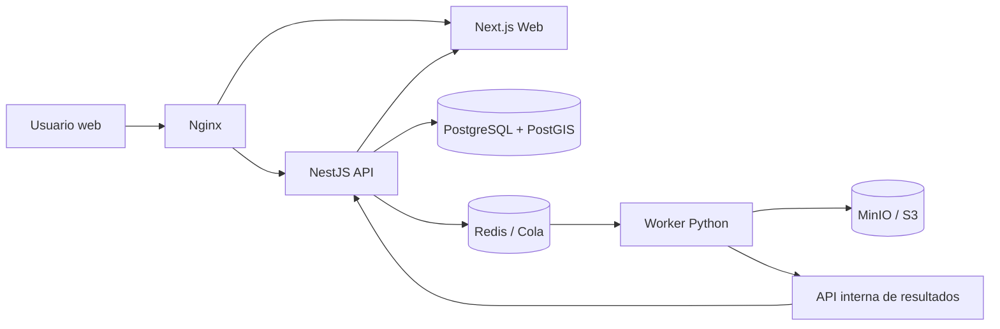
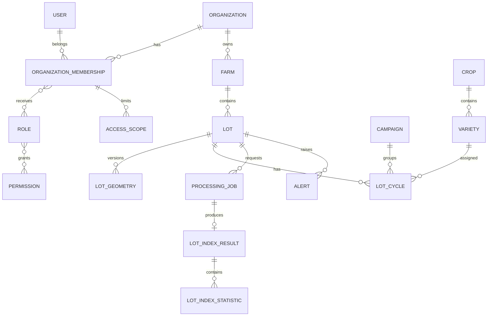

# Plataforma Web SaaS de Inteligencia Agrícola Geoespacial
## Documento maestro inicial de producto, arquitectura, seguridad y desarrollo

**Estado:** Documento maestro en evolución controlada  
**Versión:** 0.4.0  
**Fecha:** 2026-07-03  
**Nombre provisional del producto:** AgroSpatial Intelligence Platform  
**Alcance actual:** Plataforma web centralizada. La aplicación móvil queda fuera de la primera fase.

---

# 1. Propósito del documento

Este documento define la primera base formal del proyecto. Su objetivo es evitar que la solución se construya de manera improvisada, con tecnologías sueltas, carpetas fuera de lugar, reglas de seguridad incompletas o módulos sin una arquitectura común.

Este archivo debe funcionar como fuente inicial de verdad para:

- La visión del producto.
- El alcance funcional.
- La arquitectura del sistema.
- El modelo multiempresa.
- La gestión de usuarios, roles y permisos.
- El trabajo geoespacial por lote.
- El procesamiento satelital y NDVI.
- La estructura del repositorio.
- La ubicación correcta de configuraciones como Tailwind CSS.
- La estrategia de documentación.
- Las reglas para agentes o asistentes de desarrollo.
- La seguridad, despliegue, pruebas y observabilidad.
- Las fases de implementación.

Este documento no reemplaza los ADR, diagramas especializados, contratos de API ni documentos de dominio. Es el documento maestro desde el cual se crearán los demás.

---

# 2. Visión del producto

Construir una plataforma web SaaS multiempresa para administrar información agrícola a nivel de lote, representar cada lote mediante polígonos geográficos, consultar imágenes satelitales, procesar índices de vegetación, visualizar su evolución histórica y centralizar datos agronómicos, varietales y productivos.

La plataforma no será solamente un visor de mapas ni una página que muestre una imagen NDVI. Debe convertirse en una herramienta de inteligencia agrícola que integre:

- Estructura empresarial.
- Fundos y lotes.
- Cultivos y variedades.
- Campañas agrícolas.
- Polígonos geográficos.
- Imágenes satelitales.
- Índices de vegetación.
- Comparaciones temporales.
- Alertas.
- Reportes.
- Auditoría.
- Usuarios, roles y permisos.
- Alcance de datos por organización, fundo o lote.

La experiencia del usuario debe ser unificada. Aunque internamente existan servicios distintos, el cliente percibirá una sola plataforma.

---

# 3. Principios del proyecto

## 3.1. Una sola plataforma centralizada

Toda la experiencia funcional estará centralizada en una aplicación web.

El usuario no tendrá que ingresar a herramientas separadas para:

1. Crear lotes.
2. Dibujar polígonos.
3. Solicitar procesamiento.
4. Revisar NDVI.
5. Comparar fechas.
6. Crear alertas.
7. Administrar accesos.

Todos esos procesos vivirán dentro del mismo producto.

## 3.2. Web primero

La primera versión será completamente web.

La aplicación móvil queda reservada para una fase futura, cuando exista una necesidad validada de:

- Levantamiento GPS caminando el perímetro.
- Trabajo sin conexión.
- Inspecciones en campo.
- Fotografías georreferenciadas.
- Sincronización posterior.

No se desarrollará una app móvil en el MVP.

## 3.3. El lote es la unidad principal de análisis

La unidad de trabajo geográfica y productiva será el lote.

Cada lote podrá relacionarse con:

- Una organización.
- Un fundo.
- Uno o varios polígonos históricos.
- Un cultivo.
- Una variedad.
- Una campaña.
- Un área productiva.
- Procesamientos satelitales.
- Estadísticas temporales.
- Alertas.
- Reportes.

## 3.4. SaaS multiempresa desde el diseño

Aunque inicialmente la plataforma sea usada por un grupo limitado de clientes, toda la arquitectura se diseñará como SaaS multiempresa.

Cada organización tendrá aislamiento lógico de:

- Usuarios.
- Roles.
- Permisos.
- Fundos.
- Lotes.
- Campañas.
- Resultados satelitales.
- Alertas.
- Archivos.
- Auditoría.

## 3.5. Seguridad en varias capas

Ocultar un botón en el frontend no se considera seguridad.

La autorización se validará en:

1. La interfaz.
2. La API.
3. La capa de acceso a datos.
4. La base de datos, cuando corresponda.

## 3.6. Procesos pesados fuera de la solicitud web

Los procesos geoespaciales no se ejecutarán dentro de una solicitud HTTP larga.

El procesamiento se realizará de forma asíncrona mediante trabajos en cola.

## 3.7. Documentación antes de improvisación

Las decisiones importantes deben quedar documentadas.

No se cambiará un framework, patrón, librería principal o estrategia de datos sin registrar:

- El problema.
- Las opciones evaluadas.
- La decisión.
- Sus consecuencias.
- La fecha.
- El responsable.

## 3.8. Configuraciones dentro de su contexto

Ninguna configuración debe quedar “flotando” sin motivo en la raíz del repositorio.

Ejemplo explícito:

- La configuración de Tailwind pertenece a la aplicación web.
- El archivo de PostCSS pertenece a la aplicación web.
- El `components.json` de shadcn/ui pertenece a la aplicación web.
- Los estilos globales pertenecen a la aplicación web.
- Las configuraciones compartidas solo irán a `packages/` cuando realmente sean reutilizadas.

---

# 4. Alcance funcional inicial

## 4.1. Módulos principales

La primera versión debe considerar los siguientes módulos:

1. Administración de plataforma.
2. Organizaciones o empresas.
3. Usuarios.
4. Roles y permisos.
5. Catálogos agrícolas.
6. Fundos.
7. Lotes.
8. Polígonos.
9. Campañas.
10. Cultivos y variedades.
11. Mapa geoespacial.
12. Fuentes satelitales.
13. Procesamiento NDVI.
14. Historial y comparación.
15. Alertas.
16. Reportes.
17. Auditoría.
18. Configuración.

## 4.2. Fuera del alcance inicial

Quedan fuera del MVP:

- Aplicación móvil.
- Levantamiento GPS caminando.
- Trabajo offline.
- Sensores IoT.
- Integración con maquinaria.
- Modelos predictivos de rendimiento.
- Facturación SaaS automática.
- Pasarela de pagos.
- Kubernetes.
- Microservicios completos.
- Inteligencia artificial generativa dentro del producto.
- Predicción automática de cosecha.
- Automatización de riego.
- Integración con drones.

Estas funciones podrán incorporarse posteriormente sin modificar el principio central de la plataforma.

---

# 5. Modelo multiempresa

## 5.1. Conceptos

Se usarán los siguientes términos:

- **Usuario:** persona identificada globalmente por su correo.
- **Organización:** empresa cliente dentro de la plataforma.
- **Membresía:** relación entre un usuario y una organización.
- **Rol:** conjunto de permisos dentro de una organización.
- **Permiso:** autorización para ejecutar una acción.
- **Alcance:** límite de los datos sobre los que se puede ejecutar esa acción.
- **Tenant:** sinónimo técnico de organización cliente.

## 5.2. Un usuario puede pertenecer a varias empresas

El correo electrónico identifica una cuenta global.

Ejemplo:

```text
usuario@correo.com
├── Empresa Agrícola Norte → Rol: Administrador
├── Empresa Agrícola Sur   → Rol: Analista
└── Consultora Agro        → Rol: Consultor
```

El usuario no debe crear una contraseña distinta para cada empresa.

Después del inicio de sesión:

- Si pertenece a una sola organización, ingresa directamente.
- Si pertenece a varias organizaciones, selecciona la organización activa.
- Puede cambiar de organización desde el menú, sin cerrar sesión.
- Cada cambio de organización actualiza el contexto de autorización.

## 5.3. Diferenciación por correo

El correo será único globalmente dentro de la plataforma.

Reglas:

- Un mismo correo representa un mismo usuario global.
- Un correo diferente representa otra cuenta.
- Una cuenta puede tener varias membresías.
- El acceso a una organización depende de su membresía activa.
- No se debe confiar solamente en el correo enviado por el frontend.
- La organización activa debe validarse contra las membresías reales del usuario.

## 5.4. Contexto de organización activa

La sesión debe contener o resolver:

- `user_id`
- `active_organization_id`
- `membership_id`
- roles asociados
- permisos efectivos
- alcances efectivos
- fecha de expiración
- identificador de sesión

El frontend puede solicitar el cambio de organización, pero la API debe verificar que el usuario tenga una membresía activa en esa organización.

## 5.5. Aislamiento

Toda entidad perteneciente a un cliente debe incluir `organization_id`.

Ejemplos:

- `farms.organization_id`
- `lots.organization_id`
- `campaigns.organization_id`
- `satellite_jobs.organization_id`
- `alerts.organization_id`
- `audit_logs.organization_id`

No se debe permitir que una consulta de un cliente devuelva datos de otro.

---

# 6. Usuarios, roles, permisos y alcances

## 6.1. Modelo recomendado

Se utilizará una combinación de:

- **RBAC:** permisos agrupados mediante roles.
- **Permisos por acción:** cada operación tiene una clave explícita.
- **Data Scoping:** restricciones por organización, fundo, lote o asignación.
- **Excepciones controladas:** concesiones o denegaciones directas limitadas.
- **Auditoría:** registro de toda modificación sensible.

## 6.2. Jerarquía de navegación

La interfaz puede organizarse así:

```text
Módulo
└── Submódulo
    └── Sección o recurso
        └── Acción
```

Ejemplo:

```text
Monitoreo satelital
└── NDVI
    ├── Ver
    ├── Procesar
    ├── Comparar
    ├── Descargar
    ├── Eliminar resultado
    └── Configurar umbrales
```

La jerarquía visual no debe confundirse con la autorización. La autorización final se expresa mediante claves de permiso.

## 6.3. Convención de permisos

Las claves deben ser estables y no depender del texto visible de la interfaz.

Formato recomendado:

```text
recurso.accion
```

Ejemplos:

```text
organizations.read
organizations.create
organizations.update
organizations.suspend

users.read
users.invite
users.update
users.suspend
users.revoke_sessions

roles.read
roles.create
roles.update
roles.clone
roles.delete
roles.assign

farms.read
farms.create
farms.update
farms.delete
farms.export

lots.read
lots.create
lots.update
lots.delete
lots.export

lots.geometry.read
lots.geometry.create
lots.geometry.update
lots.geometry.delete
lots.geometry.import

satellite.sources.read
satellite.jobs.create
satellite.jobs.read
satellite.jobs.cancel

satellite.ndvi.read
satellite.ndvi.process
satellite.ndvi.compare
satellite.ndvi.download
satellite.ndvi.delete

alerts.read
alerts.create
alerts.update
alerts.resolve
alerts.delete

reports.read
reports.export

audit.read
```

## 6.4. Permisos por acción

No se otorgará acceso únicamente a una pantalla completa.

Ejemplo:

Un usuario puede:

- Ver lotes.
- Exportar lotes.
- No crear lotes.
- No editar polígonos.
- Sí consultar NDVI.
- No ejecutar nuevos procesamientos.

Esto permite una administración precisa.

## 6.5. Alcance de datos

Todo permiso relevante debe combinarse con un alcance.

Alcances iniciales:

- Toda la organización.
- Fundos específicos.
- Lotes específicos.
- Solo recursos asignados al usuario.
- Solo recursos creados por el usuario.
- Sin acceso.

Ejemplo:

```text
Permiso: lots.update
Alcance: fundos [Mar Verde, Gloria]
```

Resultado:

El usuario puede editar lotes, pero únicamente dentro de esos fundos.

## 6.6. Reglas de alcance

1. Un alcance nunca puede ampliar un permiso inexistente.
2. El usuario debe tener primero el permiso de acción.
3. Después se determina sobre qué registros aplica.
4. Las consultas deben filtrar por organización y alcance.
5. El frontend debe reflejar el alcance, pero la API es la autoridad.
6. Los identificadores recibidos desde el cliente deben validarse contra el alcance real.

## 6.7. Roles por organización

Los roles pertenecen a una organización.

Ejemplo:

```text
Empresa A
├── Administrador
├── Jefe agrícola
├── Analista
└── Consulta

Empresa B
├── Administrador
├── Supervisor
└── Técnico
```

Dos roles con el mismo nombre pueden tener permisos diferentes en organizaciones distintas.

## 6.8. Roles del sistema

Se consideran dos niveles:

### Roles internos de plataforma

- Superadministrador.
- Soporte.
- Operaciones.
- Auditor interno.

### Roles de organización

- Administrador de organización.
- Jefe agrícola.
- Analista.
- Supervisor.
- Consulta.
- Operador satelital.
- Rol personalizado.

Los roles internos no deben mezclarse con los roles de una organización.

## 6.9. Plantillas de roles

El sistema podrá ofrecer plantillas:

- Administrador.
- Jefe agrícola.
- Analista.
- Supervisor.
- Solo lectura.
- Operador satelital.

Una plantilla sirve para crear roles iniciales, pero después cada organización puede personalizarlos.

## 6.10. Duplicación de roles y permisos

Se debe permitir:

- Duplicar un rol dentro de la misma organización.
- Copiar un rol hacia otra organización.
- Copiar una matriz completa de roles.
- Crear roles desde plantillas.
- Comparar dos roles.

Al copiar un rol entre empresas:

Se copia:

- Nombre, si se confirma.
- Descripción.
- Claves de permisos.
- Reglas generales de acción.

No se copia automáticamente:

- Usuarios.
- Membresías.
- Fundos.
- Lotes.
- Identificadores de alcance del cliente origen.
- Excepciones personales.

Los alcances que dependan de fundos o lotes deberán:

- Reasignarse manualmente.
- Mapearse mediante equivalencias.
- O quedar en estado pendiente.

## 6.11. Excepciones por usuario

Se permitirán excepciones limitadas:

- Concesión directa.
- Denegación directa.

Prioridad propuesta:

```text
Denegación directa
> Concesión directa
> Permiso heredado del rol
> Denegación por defecto
```

La denegación explícita gana sobre una concesión.

Se recomienda evitar el uso excesivo de excepciones. Si varios usuarios necesitan la misma excepción, debe crearse un rol nuevo.

## 6.12. Matriz visual de permisos

La interfaz administrativa debe permitir:

- Buscar permisos.
- Filtrar por módulo.
- Seleccionar una fila.
- Seleccionar una columna.
- Expandir submódulos.
- Ver permisos heredados.
- Ver permisos directos.
- Ver denegaciones.
- Comparar roles.
- Duplicar roles.
- Restaurar cambios antes de guardar.
- Mostrar impacto sobre usuarios.

## 6.13. Ciclo de vida del usuario

Estados:

- Invitado.
- Activo.
- Suspendido.
- Bloqueado.
- Invitación vencida.
- Eliminado lógicamente.

Flujo de invitación:

```text
Administrador invita
→ Usuario recibe enlace
→ Valida correo
→ Configura acceso
→ Acepta términos
→ Membresía queda activa
```

Al suspender:

- Se revocan sesiones activas.
- Se mantiene la auditoría.
- No se elimina el historial.
- No se transfieren automáticamente recursos sin confirmación.

---

# 7. Modelo agrícola y geoespacial

## 7.1. Jerarquía principal

```text
Organización
└── Fundo
    └── Lote
        ├── Geometría
        ├── Campaña
        ├── Cultivo
        ├── Variedad
        ├── Área
        ├── Historial satelital
        └── Alertas
```

## 7.2. Separación entre lote y ciclo productivo

El lote es una unidad física.

La variedad o campaña puede cambiar con el tiempo.

Por ello se recomienda separar:

- `lot`
- `lot_geometry`
- `lot_cycle`
- `crop`
- `variety`
- `campaign`

Ejemplo:

```text
Lote L-001
├── Geometría vigente
├── Geometrías anteriores
├── Ciclo 2025-2026 → Arándano / Biloxi
└── Ciclo 2026-2027 → Arándano / Madeira
```

## 7.3. Geometrías

Tipo recomendado:

```text
MultiPolygon, SRID 4326
```

Se debe soportar:

- Dibujar.
- Editar vértices.
- Mover.
- Eliminar.
- Importar.
- Validar.
- Calcular área.
- Detectar intersecciones.
- Guardar versiones.

## 7.4. Historial de geometrías

No se debe sobrescribir una geometría sin conservar trazabilidad.

Cada cambio debe registrar:

- Lote.
- Geometría anterior.
- Geometría nueva.
- Usuario.
- Fecha.
- Motivo.
- Método de creación.
- Área anterior.
- Área nueva.

## 7.5. Métodos de creación del polígono

Primera fase:

- Dibujo manual desde la web.
- Importación GeoJSON.
- Importación KML/KMZ.
- Importación Shapefile, si se valida para el MVP.

Fase futura:

- Captura GPS desde app.
- Integración con drones.
- Integración con dispositivos GNSS.

## 7.6. Validaciones espaciales

Antes de guardar:

- Geometría válida.
- Polígono cerrado.
- Sin auto-intersecciones.
- Área mayor que cero.
- Coordenadas dentro de rangos válidos.
- Consistencia de SRID.
- Revisión de superposición con lotes existentes.
- Confirmación cuando exista una intersección.

---

# 8. Monitoreo satelital y NDVI

## 8.1. Objetivo

El sistema debe permitir analizar la evolución de la vegetación dentro del polígono de cada lote.

El NDVI se tratará como un indicador de vigor o actividad vegetal, no como una medición directa de kilos, rendimiento o número exacto de hojas.

## 8.2. Flujo de usuario

```text
Abrir lote
→ Seleccionar rango de fechas
→ Consultar escenas disponibles
→ Revisar nubosidad
→ Solicitar procesamiento
→ Ver progreso
→ Visualizar mapa NDVI
→ Ver estadísticas
→ Comparar con otra fecha
→ Descargar o generar alerta
```

## 8.3. Resultados esperados

Por lote y fecha:

- NDVI promedio.
- NDVI mínimo.
- NDVI máximo.
- Desviación.
- Percentiles.
- Distribución por rangos.
- Porcentaje de superficie con vigor bajo, medio y alto.
- Calidad de escena.
- Nubosidad.
- Fuente.
- Resolución.
- Fecha de adquisición.
- Archivo raster resultante.
- Vista previa optimizada.

## 8.4. Índices futuros

La arquitectura debe permitir agregar:

- NDRE.
- NDMI.
- SAVI.
- EVI.
- GNDVI.
- Otros índices definidos mediante configuración.

No se debe acoplar la solución únicamente a NDVI.

## 8.5. Abstracción de proveedor

La plataforma debe usar adaptadores para proveedores satelitales.

Principio:

```text
Proveedor A
Proveedor B
Proveedor C
      ↓
Interfaz común de escenas
      ↓
Servicio de procesamiento
```

Así se evita depender de una sola plataforma externa.

## 8.6. Almacenamiento

Los archivos grandes no se guardarán directamente en PostgreSQL.

Se utilizará almacenamiento compatible con objetos:

- MinIO en entorno local o privado.
- S3 compatible en producción.

PostgreSQL guardará:

- Clave del archivo.
- Metadatos.
- Estado.
- Estadísticas.
- Fuente.
- Fechas.
- Referencias de lote y organización.

---

# 9. Arquitectura propuesta

## 9.1. Estilo arquitectónico

Se recomienda:

- Monorepo.
- Monolito modular para la API.
- Servicio especializado de geoprocesamiento.
- Procesamiento asíncrono.
- Comunicación interna controlada.
- Separación clara de responsabilidades.

No se recomienda iniciar con muchos microservicios.

## 9.2. Componentes



## 9.3. Responsabilidades

### Next.js

- Interfaz.
- Rutas web.
- Componentes.
- Mapas.
- Formularios.
- Tablas.
- Visualización.
- Gestión de estado de servidor.
- Validación de experiencia.
- No ejecutar geoprocesamiento pesado.
- No acceder directamente a la base de datos.

### NestJS

- API principal.
- Autenticación.
- Autorización.
- Multiempresa.
- Reglas de negocio.
- Catálogos.
- Fundos.
- Lotes.
- Roles.
- Permisos.
- Auditoría.
- Creación de trabajos.
- Consulta de estados.
- Registro final de resultados.

### Python

- Descarga o lectura de escenas.
- Recorte por polígono.
- Reproyección.
- Cálculo de índices.
- Estadísticas zonales.
- Generación de raster.
- Generación de vista previa.
- Validación geoespacial avanzada.
- Procesos pesados.

### Redis y cola

- Cola de trabajos.
- Reintentos.
- Progreso.
- Bloqueos.
- Evitar procesamiento duplicado.
- Cancelación cuando sea posible.

### PostgreSQL + PostGIS

- Datos transaccionales.
- Relaciones.
- Geometrías.
- Consultas espaciales.
- Auditoría.
- Estado de trabajos.
- Estadísticas consolidadas.

### MinIO o S3

- GeoTIFF.
- PNG de previsualización.
- Archivos importados.
- Exportaciones.
- Evidencias futuras.

## 9.4. Comunicación con Python

Python no estará dentro del frontend.

Vivirá dentro de la misma infraestructura, como servicio o worker privado.

Flujo:

```text
Web
→ API crea trabajo
→ API publica trabajo
→ Worker Python procesa
→ Worker guarda archivos
→ Worker reporta resultado
→ API actualiza base de datos
→ Web consulta o recibe actualización
```

## 9.5. API interna

El worker deberá reportar resultados mediante un endpoint interno firmado.

Ejemplo:

```text
POST /internal/geo/jobs/{jobId}/complete
POST /internal/geo/jobs/{jobId}/progress
POST /internal/geo/jobs/{jobId}/fail
```

La API interna:

- No se expone públicamente.
- Usa autenticación entre servicios.
- Valida el identificador del trabajo.
- No confía en datos arbitrarios.
- Registra auditoría técnica.

---

# 10. Stack tecnológico recomendado

## 10.1. Web

- Next.js.
- React.
- TypeScript.
- Tailwind CSS.
- shadcn/ui.
- Radix UI.
- Lucide Icons.
- TanStack Query.
- TanStack Table.
- React Hook Form.
- Zod.
- Zustand, solo para estado de interfaz que realmente lo requiera.
- MapLibre GL JS.
- Terra Draw o herramienta compatible para dibujo.
- Apache ECharts para gráficos.

## 10.2. API

- NestJS.
- TypeScript.
- Prisma para datos administrativos.
- SQL directo para operaciones PostGIS avanzadas.
- OpenAPI.
- Zod o validación equivalente coherente.
- Pino para logs estructurados.

## 10.3. Geoprocesamiento

- Python.
- FastAPI para endpoints internos cuando sean necesarios.
- Rasterio.
- GeoPandas.
- GDAL.
- Shapely.
- NumPy.
- PyProj.
- Librería de cola seleccionada mediante ADR.

## 10.4. Datos e infraestructura

- PostgreSQL.
- PostGIS.
- Redis.
- MinIO o S3.
- Docker.
- Docker Compose.
- Nginx.
- pnpm.
- Turborepo.

## 10.5. Calidad

- ESLint.
- Prettier.
- Husky.
- lint-staged.
- Vitest.
- Playwright.
- Pytest.
- Ruff.
- mypy o pyright.
- Commitlint, si se aprueba.

---

# 11. Estructura del repositorio

## 11.1. Regla principal

Cada archivo debe vivir dentro del contexto al que pertenece.

No se colocarán configuraciones específicas de la web en la raíz sin una razón documentada.

## 11.2. Árbol propuesto

```text
agro-spatial-platform/
├── apps/
│   ├── web/
│   │   ├── public/
│   │   ├── src/
│   │   │   ├── app/
│   │   │   │   ├── (auth)/
│   │   │   │   ├── (platform)/
│   │   │   │   ├── (tenant)/
│   │   │   │   ├── api/
│   │   │   │   ├── layout.tsx
│   │   │   │   └── globals.css
│   │   │   ├── components/
│   │   │   │   ├── ui/
│   │   │   │   ├── maps/
│   │   │   │   ├── forms/
│   │   │   │   ├── tables/
│   │   │   │   └── layouts/
│   │   │   ├── features/
│   │   │   │   ├── auth/
│   │   │   │   ├── organizations/
│   │   │   │   ├── users/
│   │   │   │   ├── roles/
│   │   │   │   ├── farms/
│   │   │   │   ├── lots/
│   │   │   │   ├── satellite/
│   │   │   │   ├── alerts/
│   │   │   │   └── audit/
│   │   │   ├── hooks/
│   │   │   ├── lib/
│   │   │   ├── styles/
│   │   │   ├── types/
│   │   │   └── middleware/
│   │   ├── components.json
│   │   ├── next.config.ts
│   │   ├── postcss.config.mjs
│   │   ├── tailwind.config.ts
│   │   ├── tsconfig.json
│   │   ├── package.json
│   │   └── Dockerfile
│   │
│   └── api/
│       ├── src/
│       │   ├── main.ts
│       │   ├── app.module.ts
│       │   ├── common/
│       │   │   ├── auth/
│       │   │   ├── authorization/
│       │   │   ├── tenancy/
│       │   │   ├── audit/
│       │   │   ├── errors/
│       │   │   └── observability/
│       │   ├── modules/
│       │   │   ├── organizations/
│       │   │   ├── memberships/
│       │   │   ├── users/
│       │   │   ├── roles/
│       │   │   ├── permissions/
│       │   │   ├── farms/
│       │   │   ├── lots/
│       │   │   ├── campaigns/
│       │   │   ├── satellite/
│       │   │   ├── jobs/
│       │   │   ├── alerts/
│       │   │   └── audit/
│       │   └── internal/
│       │       └── geo/
│       ├── prisma/
│       │   ├── schema.prisma
│       │   ├── migrations/
│       │   └── seed/
│       ├── test/
│       ├── package.json
│       ├── tsconfig.json
│       └── Dockerfile
│
├── services/
│   └── geo-worker/
│       ├── src/
│       │   ├── main.py
│       │   ├── config/
│       │   ├── jobs/
│       │   ├── providers/
│       │   ├── processing/
│       │   ├── indices/
│       │   ├── storage/
│       │   ├── clients/
│       │   ├── schemas/
│       │   └── observability/
│       ├── tests/
│       ├── pyproject.toml
│       ├── uv.lock
│       └── Dockerfile
│
├── packages/
│   ├── ui/
│   ├── contracts/
│   ├── shared-types/
│   ├── eslint-config/
│   ├── typescript-config/
│   └── testing/
│
├── infrastructure/
│   ├── docker/
│   │   ├── compose.local.yml
│   │   ├── compose.staging.yml
│   │   └── compose.production.yml
│   ├── nginx/
│   │   ├── nginx.conf
│   │   ├── conf.d/
│   │   └── templates/
│   ├── database/
│   │   ├── init/
│   │   ├── postgis/
│   │   └── backup/
│   ├── minio/
│   └── scripts/
│
├── docs/
│   ├── 00-vision/
│   ├── 01-architecture/
│   ├── 02-domain/
│   ├── 03-database/
│   ├── 04-api/
│   ├── 05-frontend/
│   ├── 06-design-system/
│   ├── 07-devops/
│   ├── 08-security/
│   ├── 09-quality/
│   └── 10-operations/
│
├── skills/
│   ├── frontend/
│   ├── backend/
│   ├── geo/
│   ├── ui-ux/
│   ├── devops/
│   ├── testing/
│   └── review/
│
├── .github/
│   ├── workflows/
│   ├── pull_request_template.md
│   └── CODEOWNERS
│
├── .env.example
├── .gitignore
├── package.json
├── pnpm-workspace.yaml
├── turbo.json
├── README.md
└── LICENSE
```

## 11.3. Ubicación de Tailwind

Tailwind pertenece a `apps/web`.

Archivos:

```text
apps/web/tailwind.config.ts
apps/web/postcss.config.mjs
apps/web/src/app/globals.css
apps/web/components.json
```

No deben quedar en la raíz del monorepo salvo que un ADR justifique una configuración compartida para varias aplicaciones web.

Si en el futuro existen varias aplicaciones que usan el mismo preset, se podrá crear:

```text
packages/tailwind-config/
```

Pero esa decisión debe ser explícita. No se creará una carpeta compartida sin una necesidad real.

## 11.4. Regla para paquetes compartidos

Un componente o configuración solo irá a `packages/` si:

- Es utilizado por más de una aplicación.
- Tiene una API estable.
- No depende de rutas internas de una aplicación.
- Tiene pruebas.
- Tiene propietario definido.

No se moverá código a `packages/` solo para “ordenar”.

---

# 12. Documentación

## 12.1. Estructura

```text
docs/
├── 00-vision/
│   ├── product-vision.md
│   ├── scope.md
│   ├── roadmap.md
│   └── glossary.md
│
├── 01-architecture/
│   ├── system-context.md
│   ├── container-diagram.md
│   ├── component-diagram.md
│   ├── data-flow.md
│   ├── deployment.md
│   └── decisions/
│
├── 02-domain/
│   ├── tenant-model.md
│   ├── identity-access.md
│   ├── farms-lots.md
│   ├── satellite-processing.md
│   └── alerts.md
│
├── 03-database/
│   ├── erd.md
│   ├── naming.md
│   ├── spatial-model.md
│   ├── migrations.md
│   └── retention.md
│
├── 04-api/
│   ├── conventions.md
│   ├── authentication.md
│   ├── authorization.md
│   ├── errors.md
│   ├── pagination.md
│   ├── idempotency.md
│   └── versioning.md
│
├── 05-frontend/
│   ├── architecture.md
│   ├── routing.md
│   ├── state-management.md
│   ├── forms.md
│   ├── maps.md
│   └── accessibility.md
│
├── 06-design-system/
│   ├── principles.md
│   ├── colors.md
│   ├── typography.md
│   ├── spacing.md
│   ├── components.md
│   ├── data-visualization.md
│   └── map-states.md
│
├── 07-devops/
│   ├── environments.md
│   ├── docker.md
│   ├── nginx.md
│   ├── ci-cd.md
│   ├── backup.md
│   └── recovery.md
│
├── 08-security/
│   ├── threat-model.md
│   ├── secrets.md
│   ├── sessions.md
│   ├── tenancy.md
│   ├── permissions.md
│   └── support-access.md
│
├── 09-quality/
│   ├── testing-strategy.md
│   ├── definition-of-done.md
│   ├── pull-request-review.md
│   └── release-checklist.md
│
└── 10-operations/
    ├── monitoring.md
    ├── incident-response.md
    ├── job-recovery.md
    └── runbooks/
```

## 12.2. ADR

Formato:

```text
ADR-001-use-nextjs.md
ADR-002-use-nestjs.md
ADR-003-use-postgis.md
ADR-004-use-python-worker.md
ADR-005-use-maplibre.md
ADR-006-use-multi-tenancy.md
ADR-007-use-monorepo.md
ADR-008-use-rbac-with-data-scopes.md
ADR-009-object-storage.md
ADR-010-tailwind-location.md
```

Cada ADR incluirá:

- Título.
- Estado.
- Contexto.
- Decisión.
- Alternativas.
- Consecuencias positivas.
- Consecuencias negativas.
- Riesgos.
- Fecha.
- Responsable.

---

# 13. Carpeta `skills`

## 13.1. Objetivo

La carpeta `skills` contendrá instrucciones pequeñas y reutilizables para agentes de desarrollo.

Su finalidad es:

- Reducir tokens.
- Evitar repetir toda la arquitectura.
- Mantener patrones.
- Disminuir errores.
- Acelerar revisiones.
- Dar contexto específico por tarea.

## 13.2. Reglas

Cada skill debe:

- Tener un objetivo único.
- Indicar archivos permitidos.
- Indicar archivos que no debe modificar.
- Exigir lectura de documentos relacionados.
- Incluir criterios de aceptación.
- Incluir pruebas necesarias.
- Ser corta.
- No duplicar documentación completa.
- Referenciar la fuente de verdad.

## 13.3. Estructura propuesta

```text
skills/
├── frontend/
│   ├── create-page/
│   │   └── SKILL.md
│   ├── create-feature/
│   │   └── SKILL.md
│   ├── create-form/
│   │   └── SKILL.md
│   ├── create-data-table/
│   │   └── SKILL.md
│   ├── create-map-layer/
│   │   └── SKILL.md
│   └── review-frontend/
│       └── SKILL.md
│
├── backend/
│   ├── create-module/
│   │   └── SKILL.md
│   ├── create-endpoint/
│   │   └── SKILL.md
│   ├── create-use-case/
│   │   └── SKILL.md
│   ├── add-permission/
│   │   └── SKILL.md
│   ├── add-tenant-filter/
│   │   └── SKILL.md
│   └── review-backend/
│       └── SKILL.md
│
├── geo/
│   ├── validate-geometry/
│   │   └── SKILL.md
│   ├── process-index/
│   │   └── SKILL.md
│   ├── clip-raster/
│   │   └── SKILL.md
│   ├── zonal-statistics/
│   │   └── SKILL.md
│   └── review-geo-job/
│       └── SKILL.md
│
├── ui-ux/
│   ├── dashboard/
│   │   └── SKILL.md
│   ├── empty-state/
│   │   └── SKILL.md
│   ├── loading-state/
│   │   └── SKILL.md
│   ├── permissions-matrix/
│   │   └── SKILL.md
│   └── accessibility-review/
│       └── SKILL.md
│
├── devops/
│   ├── add-docker-service/
│   │   └── SKILL.md
│   ├── add-nginx-route/
│   │   └── SKILL.md
│   └── add-environment-variable/
│       └── SKILL.md
│
├── testing/
│   ├── unit-tests/
│   │   └── SKILL.md
│   ├── integration-tests/
│   │   └── SKILL.md
│   └── e2e-tests/
│       └── SKILL.md
│
└── review/
    ├── security-review/
    │   └── SKILL.md
    ├── tenancy-review/
    │   └── SKILL.md
    └── architecture-review/
        └── SKILL.md
```

## 13.4. Ejemplo mínimo de skill backend

```markdown
# Crear endpoint multiempresa

## Antes de modificar
- Leer `docs/04-api/conventions.md`.
- Leer `docs/08-security/tenancy.md`.
- Leer el módulo existente.

## Reglas
- Validar autenticación.
- Resolver `organization_id` desde la sesión.
- No aceptar `organization_id` como autoridad desde el body.
- Validar permiso por acción.
- Aplicar alcance de datos.
- Registrar auditoría si la acción es sensible.
- Añadir prueba de acceso cruzado entre organizaciones.
- Actualizar OpenAPI.

## No hacer
- No colocar lógica en el controller.
- No consultar sin tenant.
- No exponer errores internos.
- No modificar módulos no relacionados.
```

---

# 14. Modelo de datos inicial

## 14.1. Entidades principales

```text
users
organizations
organization_memberships
roles
permissions
role_permissions
membership_roles
membership_permission_overrides
access_scopes
sessions
invitations

farms
lots
lot_geometries
campaigns
crops
varieties
lot_cycles

satellite_sources
satellite_scenes
processing_jobs
processing_job_events
vegetation_indices
lot_index_results
lot_index_statistics
alerts

stored_objects
audit_logs
```

## 14.2. Diagrama conceptual



## 14.3. Identificadores

Se recomienda usar UUID o identificadores distribuidos consistentes.

No exponer identificadores secuenciales si pueden facilitar enumeración de recursos.

## 14.4. Eliminación

Por defecto:

- Eliminación lógica para entidades de negocio.
- Eliminación física solo para datos temporales o cuando exista política.
- Auditoría obligatoria.
- Restricciones cuando existan relaciones activas.

---

# 15. API

## 15.1. Principios

- REST inicialmente.
- Contratos documentados con OpenAPI.
- Errores consistentes.
- Paginación.
- Filtros explícitos.
- Ordenamiento permitido por lista blanca.
- Idempotencia para operaciones sensibles.
- Autorización por permiso y alcance.
- Sin lógica de negocio en controladores.

## 15.2. Ejemplos

```text
POST   /auth/login
POST   /auth/switch-organization
GET    /me
GET    /me/organizations

GET    /organizations/:id
GET    /organizations/:id/memberships

GET    /roles
POST   /roles
POST   /roles/:id/clone
POST   /roles/:id/copy-to-organization

GET    /farms
POST   /farms

GET    /lots
POST   /lots
GET    /lots/:id
PATCH  /lots/:id

POST   /lots/:id/geometries
PATCH  /lots/:id/geometries/:geometryId

GET    /lots/:id/satellite/scenes
POST   /lots/:id/satellite/jobs
GET    /satellite/jobs/:jobId
GET    /lots/:id/indices/ndvi
```

## 15.3. No confiar en `organization_id` del cliente

El frontend puede enviar un identificador de organización para cambiar de contexto, pero una vez establecida la sesión activa:

- El tenant se resuelve desde la sesión.
- Las consultas usan el tenant resuelto.
- El body no puede forzar otro tenant.
- Los endpoints internos tienen credenciales propias.

---

# 16. Seguridad

## 16.1. Sesiones

Debe existir:

- Expiración.
- Renovación segura.
- Revocación.
- Cierre en todos los dispositivos.
- Registro de sesiones.
- Bloqueo por intentos fallidos.
- Recuperación de contraseña.
- MFA en fase prioritaria.
- Cookies seguras cuando corresponda.
- Protección CSRF según el mecanismo de sesión.

## 16.2. Acceso de soporte

El soporte no debe ingresar libremente a datos agrícolas.

Se permitirá acceso temporal con:

- Motivo obligatorio.
- Tiempo limitado.
- Aviso visible.
- Registro de auditoría.
- Revocación automática.
- Permisos reducidos.

## 16.3. Secretos

Nunca en Git.

Archivos:

```text
.env.example
```

Entornos:

- Local.
- Test.
- Staging.
- Producción.

Variables:

```text
DATABASE_URL
REDIS_URL
JWT_SECRET
SESSION_SECRET
INTERNAL_GEO_TOKEN
S3_ENDPOINT
S3_ACCESS_KEY
S3_SECRET_KEY
SATELLITE_PROVIDER_KEY
```

Los valores reales vivirán en el servidor o gestor de secretos.

## 16.4. Auditoría

Registrar:

- Usuario.
- Organización.
- Acción.
- Recurso.
- Identificador.
- Valor anterior.
- Valor nuevo.
- Fecha.
- IP.
- Agente de usuario.
- Sesión.
- Motivo, cuando corresponda.

Acciones obligatorias:

- Invitaciones.
- Suspensiones.
- Cambios de rol.
- Cambios de permisos.
- Copias de roles.
- Edición de geometría.
- Eliminación.
- Exportación.
- Acceso de soporte.
- Procesamiento satelital.
- Cambio de configuración.

---

# 17. Nginx, Docker y red

## 17.1. Exposición pública

Solo Nginx expone puertos públicos.

```text
Internet
→ 80/443
→ Nginx
```

Servicios internos:

- Web.
- API.
- Worker.
- PostgreSQL.
- Redis.
- MinIO.

No deben publicar puertos al exterior en producción.

## 17.2. Enrutamiento

Ejemplo:

```text
/                 → web
/api/             → api
/internal/geo/    → api interna, restringida
/storage/         → acceso firmado o proxy controlado
```

## 17.3. Redes Docker

Separar:

- Red pública.
- Red de aplicación.
- Red de datos.

PostgreSQL y Redis solo deben ser accesibles desde servicios autorizados.

## 17.4. Dockerfiles

Cada componente tendrá su propio Dockerfile:

```text
apps/web/Dockerfile
apps/api/Dockerfile
services/geo-worker/Dockerfile
```

No usar un único Dockerfile gigante para todo.

---

# 18. Diseño de interfaz

## 18.1. Sistema de diseño

Antes de construir pantallas se definirá:

- Paleta.
- Tipografía.
- Espaciado.
- Radios.
- Sombras.
- Iconografía.
- Componentes.
- Estados.
- Accesibilidad.
- Gráficos.
- Mapas.
- Tablas.
- Formularios.

## 18.2. Estados de mapa

- Lote normal.
- Lote seleccionado.
- Lote con alerta.
- Lote sin geometría.
- Lote sin escena disponible.
- Lote procesando.
- Lote con error.
- Lote con nubosidad alta.
- Lote con vigor bajo.
- Lote con vigor medio.
- Lote con vigor alto.

## 18.3. Permisos en interfaz

La interfaz debe:

- Ocultar acciones no permitidas.
- Deshabilitar acciones cuando convenga explicar el motivo.
- No cargar datos fuera del alcance.
- Mostrar claramente la organización activa.
- Mostrar claramente cuando soporte esté suplantando.
- Evitar que el usuario piense que un error de autorización es un fallo técnico.

---

# 19. Pruebas

## 19.1. Tipos

- Unitarias.
- Integración.
- Contrato.
- End-to-end.
- Seguridad.
- Multiempresa.
- Geoespaciales.
- Rendimiento.
- Migraciones.

## 19.2. Pruebas obligatorias de tenant

Cada módulo con datos de cliente debe incluir:

1. Usuario de organización A no ve datos de B.
2. Usuario de A no actualiza datos de B.
3. Cambiar un ID en la URL no permite acceso.
4. Un permiso sin alcance suficiente falla.
5. Una denegación explícita gana.
6. Una membresía suspendida pierde acceso.
7. Cambiar de organización actualiza el contexto.

## 19.3. Pruebas geoespaciales

- Geometría válida.
- Geometría inválida.
- Auto-intersección.
- Área.
- Reproyección.
- Recorte.
- Escena sin cobertura.
- Nubosidad alta.
- Raster corrupto.
- Reintento.
- Resultado idempotente.

---

# 20. Observabilidad y operación

## 20.1. Logs

Logs estructurados con:

- `request_id`
- `user_id`
- `organization_id`
- `session_id`
- `job_id`
- `resource_type`
- `resource_id`
- nivel
- mensaje
- duración

## 20.2. Métricas

- Solicitudes por minuto.
- Errores.
- Latencia.
- Trabajos pendientes.
- Trabajos fallidos.
- Tiempo de procesamiento.
- Uso de almacenamiento.
- Escenas procesadas.
- Reintentos.
- Consumo por organización.

## 20.3. Trazabilidad

Una solicitud de procesamiento debe poder seguirse desde:

```text
Solicitud web
→ API
→ Cola
→ Worker
→ Objeto generado
→ Registro final
```

## 20.4. Recuperación

Debe existir runbook para:

- Trabajo atascado.
- Redis caído.
- Base de datos no disponible.
- MinIO no disponible.
- Worker detenido.
- Migración fallida.
- Geometría corrupta.
- Proveedor satelital no disponible.

---

# 21. Fases de implementación

## Fase 0. Fundamentos

- Repositorio.
- Monorepo.
- Docker.
- Nginx.
- PostgreSQL/PostGIS.
- Redis.
- MinIO.
- CI inicial.
- Convenciones.
- ADR.
- Diseño base.
- Autenticación básica.

## Fase 1. Identidad y multiempresa

- Usuarios globales.
- Organizaciones.
- Membresías.
- Cambio de organización.
- Invitaciones.
- Sesiones.
- Auditoría inicial.

## Fase 2. Roles, permisos y alcances

- Catálogo de permisos.
- Roles.
- Plantillas.
- Matriz.
- Duplicación.
- Copia entre empresas.
- Alcances por fundo y lote.
- Excepciones.
- Pruebas de aislamiento.

## Fase 3. Estructura agrícola

- Fundos.
- Lotes.
- Cultivos.
- Variedades.
- Campañas.
- Ciclos de lote.
- Importación básica.

## Fase 4. Mapa y polígonos

- MapLibre.
- Dibujo.
- Edición.
- Validaciones.
- Área.
- Historial.
- Superposición.
- Permisos de geometría.

## Fase 5. Servicio geoespacial

- Cola.
- Worker.
- Proveedor inicial.
- Recorte.
- NDVI.
- Estadísticas.
- Almacenamiento.
- Progreso.
- Reintentos.

## Fase 6. Analítica

- Historial.
- Comparación.
- Gráficos.
- Clasificación.
- Descargas.
- Reportes.

## Fase 7. Alertas

- Umbrales.
- Reglas.
- Estados.
- Asignación.
- Historial.
- Notificaciones.

## Fase 8. Endurecimiento

- MFA.
- Soporte temporal.
- RLS si se aprueba.
- Monitoreo.
- Backups.
- Recuperación.
- Pruebas de carga.
- Seguridad.

---

# 22. Definición de terminado

Una funcionalidad no está terminada solo porque “se ve”.

Debe cumplir:

- Requisito funcional.
- Autorización por acción.
- Alcance de datos.
- Aislamiento multiempresa.
- Validación.
- Manejo de errores.
- Estados de carga.
- Estado vacío.
- Accesibilidad.
- Auditoría cuando corresponda.
- Pruebas.
- Documentación.
- OpenAPI si aplica.
- Revisión de seguridad.
- Sin secretos.
- Sin configuraciones fuera de lugar.
- Sin dependencias no justificadas.

---

# 23. Decisiones aprobadas en este documento

1. La primera fase será web.
2. La app móvil queda para después.
3. El lote es la unidad de análisis.
4. El polígono se podrá dibujar desde la web.
5. Python sí se utilizará.
6. Python vivirá como servicio o worker interno.
7. El frontend no ejecutará procesamiento pesado.
8. Se usará Next.js para la web.
9. Se usará NestJS para la API.
10. Se usará PostgreSQL con PostGIS.
11. Se usará un worker Python para geoprocesamiento.
12. Se usará Docker y Nginx.
13. Solo Nginx expondrá puertos en producción.
14. Se diseñará como SaaS multiempresa.
15. Un usuario global podrá pertenecer a varias empresas.
16. El correo identificará la cuenta global.
17. Los accesos se definirán por acción y alcance.
18. Se permitirán roles personalizados.
19. Se permitirán plantillas y duplicación de roles.
20. Al copiar roles no se copiarán alcances específicos sin mapeo.
21. La seguridad se validará en la API.
22. Se conservará auditoría.
23. Tailwind quedará dentro de `apps/web`.
24. La documentación y las skills formarán parte del repositorio.
25. No se iniciará con microservicios completos.
26. El sistema satelital usará adaptadores de proveedor.
27. Los archivos grandes irán a almacenamiento de objetos.
28. Los resultados y metadatos irán a PostgreSQL.
29. El sistema deberá permitir nuevos índices en el futuro.
30. Toda decisión importante se registrará mediante ADR.

---

# 24. Riesgos iniciales

## Riesgo: permisos demasiado complejos

Mitigación:

- Convención estable.
- Roles base.
- Excepciones limitadas.
- Simulador de permisos.
- Comparador.
- Auditoría.

## Riesgo: fuga entre clientes

Mitigación:

- `organization_id` obligatorio.
- Contexto de tenant en la sesión.
- Filtros centralizados.
- Pruebas de acceso cruzado.
- Revisión de seguridad.
- Posible RLS.

## Riesgo: geoprocesamiento lento

Mitigación:

- Cola.
- Worker.
- Caché.
- Reutilización de escenas.
- Idempotencia.
- Paralelismo controlado.
- Previsualizaciones.

## Riesgo: costo de almacenamiento

Mitigación:

- Políticas de retención.
- Compresión.
- Separar originales y derivados.
- No duplicar archivos.
- Medición por organización.

## Riesgo: stack sobredimensionado

Mitigación:

- Monolito modular.
- Un solo repositorio.
- Fases.
- ADR.
- No crear servicios sin necesidad.

## Riesgo: configuraciones desordenadas

Mitigación:

- Propiedad por aplicación.
- Revisión de arquitectura.
- Árbol oficial.
- Skill de creación de configuración.
- Regla explícita para Tailwind, PostCSS y shadcn/ui.

---

# 25. Próximos documentos que deben crearse

1. `docs/00-vision/product-vision.md`
2. `docs/00-vision/scope.md`
3. `docs/01-architecture/system-context.md`
4. `docs/01-architecture/container-diagram.md`
5. `docs/01-architecture/decisions/ADR-001-use-nextjs.md`
6. `docs/01-architecture/decisions/ADR-008-use-rbac-with-data-scopes.md`
7. `docs/02-domain/identity-access.md`
8. `docs/02-domain/farms-lots.md`
9. `docs/03-database/erd.md`
10. `docs/05-frontend/maps.md`
11. `docs/06-design-system/principles.md`
12. `docs/08-security/tenancy.md`
13. `docs/08-security/permissions.md`
14. `docs/09-quality/testing-strategy.md`
15. Primera versión de las skills fundamentales.

---

# 26. Criterio para iniciar código

No se debe comenzar a crear módulos funcionales hasta tener aprobados como mínimo:

- Nombre provisional.
- Alcance del MVP.
- Arquitectura base.
- Estructura del repositorio.
- Modelo de usuario-organización.
- Estrategia de permisos.
- Modelo de lote.
- Estrategia de geometrías.
- Primer ADR.
- Convenciones de API.
- Sistema de diseño inicial.
- Entorno Docker local funcional.

---

# 27. Resumen ejecutivo

La solución será una plataforma web SaaS multiempresa para inteligencia agrícola geoespacial.

El usuario iniciará sesión con un correo global y podrá pertenecer a varias empresas. La plataforma distinguirá sus accesos mediante membresías, roles, permisos por acción y alcances de datos.

La unidad principal será el lote. Cada lote tendrá un polígono, campaña, cultivo, variedad e historial satelital. El usuario podrá dibujar y editar polígonos desde la web.

El frontend se construirá con Next.js. La API principal se construirá con NestJS. El procesamiento geoespacial se realizará con Python como worker interno. PostgreSQL y PostGIS almacenarán datos y geometrías. Redis manejará trabajos. MinIO o S3 guardará archivos. Nginx será la única puerta pública.

La arquitectura se organizará en un monorepo. Tailwind y sus archivos relacionados vivirán dentro de `apps/web`, no sueltos en la raíz. La documentación y las skills serán parte obligatoria del proyecto para mantener consistencia, reducir consumo de tokens y evitar decisiones improvisadas.

Este documento es la primera base formal del proyecto y debe evolucionar mediante versiones y ADR, no mediante cambios informales.

---

# 28. Aclaración definitiva del frontend: React, Next.js y TypeScript

## 28.1. Decisión

La plataforma web se desarrollará con:

```text
Next.js
+ React
+ TypeScript
```

Estas tecnologías no compiten entre sí ni representan tres frontend distintos.

- **React** será la biblioteca usada para construir componentes e interfaces.
- **Next.js** será el framework de React que organizará rutas, layouts, renderizado, carga de datos y optimizaciones de la aplicación.
- **TypeScript** será el lenguaje principal del frontend y de la API NestJS.

Por lo tanto, los archivos del frontend serán principalmente:

```text
.ts
.tsx
```

No se desarrollará la aplicación principal en JavaScript sin tipado.

## 28.2. Estructura conceptual

```text
TypeScript
└── Next.js
    └── React
        ├── páginas
        ├── layouts
        ├── formularios
        ├── mapas
        ├── tablas
        ├── gráficos
        └── componentes
```

## 28.3. Responsabilidades del frontend

El frontend será responsable de:

- Experiencia de usuario.
- Navegación.
- Organización activa.
- Interfaz de permisos.
- Gestión de fundos y lotes.
- Dibujo y edición de polígonos.
- Visualización de capas geográficas.
- Gráficos y series temporales.
- Formularios.
- Tablas.
- Estados de carga, error y vacío.
- Solicitud y seguimiento de trabajos asíncronos.

El frontend no será responsable de:

- Procesar imágenes satelitales.
- Calcular NDVI sobre archivos raster pesados.
- Conectarse directamente a PostgreSQL.
- Guardar secretos de proveedores.
- Autorizar acciones únicamente mediante botones ocultos.
- Consultar directamente proveedores climáticos desde el navegador.

## 28.4. Regla de TypeScript

Se aplicarán las siguientes reglas:

- `strict: true`.
- Evitar `any`.
- Contratos tipados.
- Validación de datos externos.
- Tipos compartidos solo cuando exista una frontera estable.
- No confiar únicamente en tipos estáticos para datos recibidos por red.
- Zod o mecanismo equivalente para validación en tiempo de ejecución.
- Errores de TypeScript bloquearán la construcción de producción.

## 28.5. Tailwind dentro de la aplicación web

Tailwind continuará ubicado dentro de:

```text
apps/web/
```

Archivos asociados:

```text
apps/web/tailwind.config.ts
apps/web/postcss.config.mjs
apps/web/components.json
apps/web/src/app/globals.css
```

No se colocarán estos archivos sueltos en la raíz del monorepo.

---

# 29. Inteligencia climática y agroclimática

## 29.1. Objetivo

Integrar pronósticos, observaciones e históricos climáticos con los lotes agrícolas para apoyar decisiones productivas.

Los datos climáticos se relacionarán inicialmente con:

- El centroide del lote.
- Una ubicación meteorológica asignada.
- Una estación propia, cuando exista.
- Uno o varios puntos para lotes extensos, en una fase posterior.

## 29.2. Variables meteorológicas

La plataforma deberá contemplar:

- Temperatura mínima.
- Temperatura máxima.
- Temperatura promedio.
- Humedad relativa.
- Precipitación.
- Probabilidad de precipitación.
- Velocidad del viento.
- Dirección del viento.
- Ráfagas.
- Nubosidad.
- Presión.
- Radiación solar.
- Punto de rocío.
- Humedad del suelo, cuando la fuente la ofrezca.
- Evapotranspiración de referencia, cuando la fuente la ofrezca.
- Fecha de emisión.
- Horizonte del pronóstico.
- Modelo meteorológico.
- Proveedor.
- Nivel de calidad.

## 29.3. Indicadores derivados

A partir de los datos climáticos podrán calcularse:

- Riesgo de helada.
- Estrés térmico.
- Grados-día.
- Horas frío.
- Déficit de presión de vapor.
- Evapotranspiración de referencia.
- Balance hídrico estimado.
- Riesgo de lluvia durante cosecha.
- Riesgo de viento fuerte.
- Ventana favorable para aplicaciones.
- Condiciones favorables para enfermedades.
- Riesgo de humedad persistente.
- Condiciones de secado.

Cada indicador debe almacenar:

- Fórmula o regla.
- Versión.
- Fuente de variables.
- Ventana temporal.
- Resultado.
- Unidad.
- Nivel de confianza.
- Fecha de cálculo.

## 29.4. Proveedores climáticos

La arquitectura será desacoplada mediante adaptadores:

```text
ClimateProvider
├── OpenMeteoProvider
├── SenamhiProvider
├── NasaPowerProvider
├── Era5Provider
└── LocalStationProvider
```

La selección definitiva de proveedores, licencias, frecuencia y uso comercial deberá documentarse mediante ADR.

## 29.5. Regla de integración

No se realizará:

```text
Navegador → proveedor climático
```

Se realizará:

```text
Scheduler
→ servicio interno
→ proveedor climático
→ normalización
→ almacenamiento
→ indicadores
→ API
→ web
```

Beneficios:

- Protección de credenciales.
- Caché.
- Historial.
- Menor consumo.
- Trazabilidad.
- Sustitución de proveedor.
- Comparación entre pronóstico y observación.

## 29.6. Frecuencias iniciales

Propuesta sujeta a validación:

```text
Pronóstico: cada 3 o 6 horas
Observaciones: cada hora
Consolidado diario: una vez al día
Histórico: carga bajo demanda o programada
```

No se consultará al proveedor cada vez que un usuario abra la pantalla.

---

# 30. Serie temporal y comparación multilote

## 30.1. Objetivo

Permitir la comparación histórica y simultánea entre varios lotes.

## 30.2. Variables comparables

- NDVI.
- NDRE.
- NDMI.
- Otros índices.
- Temperatura.
- Precipitación.
- Humedad.
- VPD.
- ET0.
- Alertas.
- Variables productivas disponibles.
- Resultados de escenarios.
- Eventos agronómicos.

## 30.3. Capacidades

- Seleccionar uno o varios lotes.
- Activar y desactivar series.
- Comparar campañas.
- Comparar variedades.
- Cambiar frecuencia diaria, semanal o mensual.
- Identificar escenas descartadas.
- Mostrar fechas faltantes.
- Mostrar nivel de nubosidad.
- Exportar datos.
- Añadir eventos agrícolas sobre la línea temporal.
- Comparar contra promedios históricos.
- Mostrar bandas de referencia.

## 30.4. Eventos sobre la serie

Ejemplos:

```text
Poda
Fertilización
Riego extraordinario
Aplicación fitosanitaria
Cosecha
Daño climático
Cambio de campaña
Inspección
```

Estos eventos ayudarán a interpretar cambios y evitar conclusiones aisladas.

---

# 31. Zonificación agronómica dentro del lote

## 31.1. Objetivo

Dividir el lote en zonas homogéneas o comparables utilizando índices y métodos configurables.

## 31.2. Métodos

- Umbrales agronómicos.
- Cuantiles.
- Desviación respecto al promedio.
- K-means.
- Clasificación histórica.
- Comparación contra lote de referencia.
- Método personalizado validado.

K-means será una alternativa, no la única regla.

## 31.3. Salida

Por zona:

- Clase.
- Color.
- Valor promedio.
- Valor mínimo.
- Valor máximo.
- Hectáreas.
- Porcentaje del lote.
- Geometría.
- Nivel de confianza.
- Método.
- Parámetros.
- Fecha de escena.
- Fecha de procesamiento.

## 31.4. Versionamiento

Cada ejecución debe conservar:

- Algoritmo.
- Versión del algoritmo.
- Parámetros.
- Número de clases.
- Índice utilizado.
- Escena.
- Usuario solicitante.
- Fecha.
- Estado.
- Resultado.

Recalcular no debe eliminar resultados anteriores.

## 31.5. Estados

- Pendiente.
- Procesando.
- Completado.
- Fallido.
- Cancelado.
- Obsoleto.
- Validado.
- Rechazado.

---

# 32. Rendimiento, escenarios y análisis económico

## 32.1. Principio

El NDVI no se convertirá directamente en kilos sin un modelo validado.

Se diferenciará claramente entre:

- Dato observado.
- Dato ingresado.
- Dato calculado.
- Dato estimado.
- Dato predicho por modelo.
- Dato validado.

## 32.2. Entradas de escenario

- Rendimiento objetivo.
- Rendimiento estimado.
- Precio por kilogramo.
- Moneda.
- Costo variable por hectárea.
- Costo de cosecha.
- Costo fijo.
- Área.
- Campaña.
- Cultivo.
- Variedad.
- Fecha de vigencia.
- Supuestos.
- Autor.

## 32.3. Resultados

- Kilogramos por hectárea.
- Kilogramos por zona.
- Producción estimada.
- Ingreso bruto.
- Costos.
- Margen bruto.
- Margen por hectárea.
- Diferencia contra objetivo.
- Escenario conservador.
- Escenario base.
- Escenario optimista.

## 32.4. Modelos futuros

Una estimación productiva seria podrá relacionar:

- Históricos productivos.
- Variedad.
- Edad del cultivo.
- Fenología.
- Evaluaciones.
- Clima.
- Índices de vegetación.
- Área.
- Peso de fruta.
- Cosecha ejecutada.
- Manejo agrícola.

Todo modelo debe tener:

- Versión.
- Fecha de entrenamiento.
- Variables.
- Métricas.
- Alcance.
- Limitaciones.
- Responsable.
- Estado de aprobación.

---

# 33. Riesgo sanitario

## 33.1. Alcance

El sistema podrá estimar condiciones de riesgo sanitario.

No afirmará automáticamente que una enfermedad está presente solo por una imagen o un índice.

La comunicación correcta será:

```text
Condiciones compatibles con riesgo
```

y no:

```text
Enfermedad confirmada
```

## 33.2. Variables

- Cultivo.
- Variedad.
- Etapa fenológica.
- Temperatura.
- Humedad.
- Lluvia.
- Duración de humedad.
- Viento.
- Vigor vegetal.
- Cambio de índice.
- Historial sanitario.
- Ubicación.
- Época.
- Observaciones validadas.

## 33.3. Resultado

- Enfermedad o problema evaluado.
- Puntaje.
- Riesgo bajo.
- Riesgo moderado.
- Riesgo alto.
- Riesgo crítico.
- Factores que aportan al resultado.
- Ventana temporal.
- Fuente técnica.
- Confianza.
- Recomendación revisada.
- Estado de validación.

## 33.4. Reglas sanitarias

Cada regla debe contener:

- Código.
- Cultivo.
- Variedad, cuando aplique.
- Problema sanitario.
- Condiciones.
- Umbrales.
- Ventana temporal.
- Fórmula.
- Fuente.
- Versión.
- Vigencia.
- Responsable técnico.
- Estado de aprobación.

## 33.5. Recomendaciones

Las recomendaciones:

- No se generarán libremente sin respaldo.
- Tendrán fuente técnica.
- Estarán versionadas.
- Considerarán país, cultivo y mercado.
- Podrán requerir aprobación agronómica.
- No reemplazarán el diagnóstico de campo.
- Diferenciarán prevención, inspección y tratamiento.

---

# 34. Validación agronómica

## 34.1. Objetivo

Permitir que un especialista confirme, descarte o deje inconcluso un resultado automático.

## 34.2. Casos validables

- Zona de bajo vigor.
- Alerta climática.
- Riesgo sanitario.
- Anomalía.
- Resultado de zonificación.
- Escenario productivo.
- Recomendación.
- Problema de calidad de datos.

## 34.3. Flujo

```text
Generado
→ Pendiente de revisión
→ Asignado
→ En revisión
→ Confirmado / descartado / inconcluso
→ Acción registrada
→ Seguimiento
→ Cerrado
```

## 34.4. Datos

- Organización.
- Fundo.
- Lote.
- Resultado origen.
- Tipo.
- Prioridad.
- Usuario asignado.
- Estado.
- Fecha.
- Comentario.
- Diagnóstico real.
- Evidencia.
- Acción tomada.
- Seguimiento.
- Fecha de cierre.

## 34.5. Valor futuro

La validación formará una base de datos confiable para:

- Medir falsos positivos.
- Mejorar reglas.
- Evaluar modelos.
- Entrenar futuros modelos.
- Comparar predicción contra realidad.
- Auditar decisiones.

---

# 35. Extensión del modelo de datos

Se añaden conceptualmente:

```text
climate_providers
weather_locations
weather_observations
weather_forecast_runs
weather_forecast_values
agroclimatic_indicator_definitions
agroclimatic_indicator_results
agroclimatic_alerts

time_series_events

zoning_runs
zoning_classes
zoning_geometries
zoning_statistics

yield_scenarios
yield_scenario_inputs
yield_scenario_results
economic_parameters
model_versions

sanitary_issues
sanitary_rules
sanitary_rule_versions
sanitary_risk_evaluations
sanitary_recommendations

validation_cases
validation_events
validation_evidence
```

Todas las entidades de cliente deberán incluir `organization_id`.

Los resultados históricos no se sobrescribirán sin conservar versión.

---

# 36. Extensión del catálogo de permisos

```text
climate.forecast.read
climate.history.read
climate.indicators.read
climate.alerts.read
climate.alerts.configure
climate.providers.manage

timeseries.read
timeseries.compare
timeseries.export
timeseries.events.manage

zoning.read
zoning.create
zoning.recalculate
zoning.validate
zoning.delete
zoning.export

yield.scenarios.read
yield.scenarios.create
yield.scenarios.update
yield.scenarios.approve
yield.scenarios.export

sanitary.risks.read
sanitary.rules.read
sanitary.rules.manage
sanitary.recommendations.read
sanitary.recommendations.approve

validation.read
validation.assign
validation.confirm
validation.reject
validation.close
validation.evidence.upload
```

Estos permisos estarán sujetos a alcance por:

- Organización.
- Fundo.
- Lote.
- Recursos asignados.

---

# 37. APIs y trabajos programados adicionales

## 37.1. Endpoints conceptuales

```text
GET  /lots/:id/weather/forecast
GET  /lots/:id/weather/history
GET  /lots/:id/agroclimatic-indicators

GET  /lots/compare/time-series

POST /lots/:id/zoning-runs
GET  /lots/:id/zoning-runs
GET  /zoning-runs/:id
POST /zoning-runs/:id/validate

POST /lots/:id/yield-scenarios
GET  /lots/:id/yield-scenarios

GET  /lots/:id/sanitary-risks
POST /sanitary-risks/:id/validation-cases

GET  /validation-cases
PATCH /validation-cases/:id
POST /validation-cases/:id/evidence
```

## 37.2. Trabajos programados

- Actualización de pronóstico.
- Ingesta de observaciones.
- Consolidado diario.
- Cálculo de indicadores.
- Evaluación de reglas sanitarias.
- Generación de alertas.
- Limpieza controlada de caché.
- Verificación de trabajos estancados.
- Reintentos.
- Control de almacenamiento.

---

# 38. Ajuste de fases

Se añaden subfases:

## Fase 6A. Series temporales

- Comparación multilote.
- Eventos agronómicos.
- Calidad de escenas.
- Exportación.

## Fase 6B. Clima

- Proveedor inicial.
- Pronóstico.
- Histórico.
- Indicadores.
- Alertas.
- Caché.

## Fase 6C. Zonificación

- Métodos.
- Ejecuciones versionadas.
- Visualización.
- Estadísticas.
- Validación.

## Fase 7A. Escenarios productivos y económicos

- Supuestos.
- Escenarios.
- Costos.
- Márgenes.
- Aprobación.

## Fase 7B. Riesgo sanitario

- Catálogo.
- Reglas versionadas.
- Evaluación.
- Recomendaciones revisadas.

## Fase 7C. Validación agronómica

- Casos.
- Asignación.
- Evidencias.
- Seguimiento.
- Cierre.

---

# 39. Política de conservación y actualización documental

## 39.1. No pérdida de información

Toda actualización del documento maestro deberá:

1. Conservar la versión anterior.
2. Crear una nueva versión.
3. Añadir un registro de cambios.
4. No borrar decisiones anteriores sin registrar su reemplazo.
5. Utilizar ADR para cambios arquitectónicos.
6. Marcar contenido obsoleto en lugar de eliminarlo silenciosamente.
7. Mantener copias versionadas.

## 39.2. Convención de archivos

```text
AGRO_GEOSPATIAL_SAAS_MASTER_v0.1.md
AGRO_GEOSPATIAL_SAAS_MASTER_v0.2.md
AGRO_GEOSPATIAL_SAAS_MASTER_v0.3.md
```

## 39.3. Registro de cambios v0.2.0

Se añadió:

- Aclaración React + Next.js + TypeScript.
- Reglas estrictas de TypeScript.
- Módulo climático.
- Proveedores climáticos desacoplados.
- Indicadores agroclimáticos.
- Serie temporal multilote.
- Eventos agronómicos.
- Zonificación versionada.
- Escenarios productivos y económicos.
- Riesgo sanitario.
- Validación agronómica.
- Nuevas entidades.
- Nuevos permisos.
- Nuevos endpoints.
- Nuevos trabajos programados.
- Política explícita de conservación documental.

No se eliminó contenido funcional de la versión 0.1.0.

---

# 40. Módulo de evaluaciones agrícolas configurables

## 40.1. Propósito

La plataforma incorporará un motor de evaluaciones agrícolas dinámicas, versionadas, asignables y guiadas.

Este módulo no será un formulario genérico aislado. Se conectará con:

- Organizaciones.
- Áreas organizacionales.
- Usuarios.
- Roles y permisos.
- Fundos.
- Lotes.
- Hileras.
- Plantas.
- Zonas geográficas.
- Cultivos.
- Variedades.
- Campañas.
- Alertas satelitales.
- Alertas climáticas.
- Riesgos sanitarios.
- Validación agronómica.
- Planificación diaria.
- Auditoría.

El sistema deberá soportar evaluaciones como:

- Conteo de racimos.
- Conteo de bayas.
- Conteo de frutos.
- Floración.
- Maduración.
- Fenología.
- Sanidad.
- Plagas.
- Enfermedades.
- Calidad.
- Riego.
- Daños.
- Productividad.
- Inspecciones generadas desde alertas.

## 40.2. Principio central

La definición de una evaluación no estará codificada de forma rígida dentro de React.

La evaluación se compondrá mediante:

```text
Plantilla
+ versión
+ campos
+ reglas
+ flujo
+ plan de muestreo
+ contexto agrícola
+ asignación
```

La API entregará la definición publicada y el frontend la interpretará.

NestJS volverá a validar cada regla antes de aceptar los datos.

## 40.3. Diferencia entre conceptos

### Catálogo de evaluación

Representa el concepto general.

Ejemplo:

```text
Conteo de madurez
Conteo de racimos
Evaluación sanitaria
```

### Plantilla

Define una forma concreta de ejecutar esa evaluación para un contexto.

Ejemplo:

```text
Conteo de madurez de arándano
Conteo de madurez de uva
```

### Versión de plantilla

Congela la configuración utilizada en un periodo.

Ejemplo:

```text
Versión 1: 10 bayas por cargador
Versión 2: 12 bayas por cargador
```

### Programación

Indica cuándo debe realizarse.

### Asignación

Indica quién o quiénes deben realizarla.

### Objetivo de evaluación

Indica dónde y sobre qué elementos se realizará.

### Sesión

Representa la ejecución real iniciada por uno o más evaluadores.

### Muestra

Representa una planta, racimo, cargador, punto o unidad evaluada.

### Resultado

Representa los valores consolidados y derivados.

---

# 41. Áreas organizacionales y propiedad funcional

## 41.1. Necesidad

Una cartilla puede pertenecer a un área determinada y no necesariamente estar disponible para toda la empresa.

Ejemplos de áreas:

- Proyecciones.
- Producción.
- Sanidad.
- Calidad.
- Riego.
- Operaciones.
- Investigación y desarrollo.
- Auditoría agrícola.
- Cosecha.

## 41.2. Modelo

Se incorporará:

```text
organizational_areas
organization_area_memberships
evaluation_area_ownership
```

Una plantilla puede ser:

- Propiedad de una sola área.
- Compartida con varias áreas.
- Global para toda la organización.
- Creada por plataforma y habilitada para clientes.

## 41.3. Reglas

- El área propietaria controla la edición de la plantilla.
- Otras áreas pueden recibir permiso de uso sin permiso de modificación.
- Un usuario puede pertenecer a varias áreas.
- La pertenencia a un área no reemplaza los permisos.
- El acceso final combina rol, permiso, alcance y área.
- Una evaluación de Sanidad no debe ser editable por Producción salvo autorización.
- Las evaluaciones compartidas deben conservar un propietario claro.

## 41.4. Permisos por área

Ejemplos:

```text
evaluations.templates.read
evaluations.templates.manage
evaluations.templates.publish
evaluations.templates.use
```

Alcance adicional:

```text
own_area
shared_areas
all_organization_areas
specific_areas
```

---

# 42. Motor configurable de campos y contadores

## 42.1. Objetivo

Permitir que cada cartilla defina exactamente cómo se comportan sus controles.

El sistema deberá saber:

- Valor mínimo.
- Valor máximo.
- Valor inicial.
- Paso de incremento.
- Paso de decremento.
- Si puede incrementarse.
- Si puede disminuirse.
- Si permite edición manual.
- Si se limpia al alcanzar un límite.
- Qué niveles se limpian.
- Qué nivel se incrementa.
- Qué ocurre con el excedente.
- Cuándo se completa una muestra.
- Cuándo se cambia de planta.
- Cuándo se cambia de hilera.
- Cuándo finaliza la cartilla.

## 42.2. Tipos de control

Inicialmente:

```text
counter
integer
decimal
text
textarea
select
multiselect
boolean
date
time
datetime
photo
location
rating
percentage
computed
group
```

## 42.3. Configuración básica de contador

Cada contador podrá definir:

```text
minimum
maximum
initial_value
increment_step
decrement_step
allow_increment
allow_decrement
allow_manual_input
allow_negative
decimal_places
required
```

Ejemplo:

```json
{
  "control": "counter",
  "minimum": 0,
  "maximum": 10,
  "initialValue": 0,
  "incrementStep": 1,
  "decrementStep": 1,
  "allowIncrement": true,
  "allowDecrement": true,
  "allowManualInput": false
}
```

## 42.4. Condición para alcanzar el límite

El comportamiento podrá dispararse cuando:

```text
value == maximum
value >= maximum
next_increment_would_exceed_maximum
manual_confirmation
```

No se asumirá que todos los campos reaccionan exactamente al llegar al máximo.

## 42.5. Comportamiento de excedente

Opciones:

```text
cap
wrap
carry
reject
confirm
```

### `cap`

El valor queda en el máximo.

```text
9 + 1 = 10
10 + 1 = 10
```

### `wrap`

El valor vuelve al mínimo.

```text
9 + 1 = 10
10 + 1 = 0
```

### `carry`

El valor reinicia y aumenta el nivel superior.

```text
Bayas 10
→ Bayas 0
→ Cargadores +1
```

### `reject`

No permite exceder y muestra una advertencia.

### `confirm`

Solicita confirmación antes de ejecutar la transición.

## 42.6. Política de limpieza

Cada regla puede definir:

```text
clear_self
clear_children
clear_descendants
clear_parent
clear_all_siblings
retain_self
retain_children
retain_parent
```

Ejemplo:

```text
Bayas alcanza 10:
- incrementar cargadores
- limpiar bayas
- conservar planta
- conservar hilera
```

Otro ejemplo:

```text
Planta alcanza el máximo de cargadores:
- guardar muestra
- limpiar bayas
- limpiar cargadores
- incrementar planta
- conservar hilera
```

## 42.7. Jerarquía de niveles

La cartilla podrá declarar niveles:

```text
Hilera
└── Planta
    └── Cargador
        └── Baya
```

Otro caso:

```text
Parcela
└── Punto de muestreo
    └── Planta
        └── Racimo
            └── Fruto
```

Cada nivel tendrá:

- Clave.
- Orden.
- Padre.
- Tipo.
- Mínimo.
- Máximo.
- Regla de transición.
- Política de limpieza.
- Mensaje.
- Requiere confirmación.
- Guardado automático.

## 42.8. Eventos del motor

Eventos disponibles:

```text
onLoad
onEnter
onChange
onIncrement
onDecrement
onMinimum
onMaximum
onBeforeOverflow
onAfterOverflow
onComplete
onReset
onUndo
onSave
onValidationError
```

## 42.9. Acciones disponibles

```text
increment
decrement
set_value
reset
clear
carry
show_message
show_confirmation
complete_level
complete_sample
advance_plant
advance_row
advance_target
save_draft
save_sample
complete_session
block_input
unblock_input
play_sound
vibrate
```

Las acciones de sonido o vibración serán opcionales y dependerán de compatibilidad del navegador.

## 42.10. Condiciones

El motor permitirá condiciones declarativas:

```text
equals
not_equals
greater_than
greater_or_equal
less_than
less_or_equal
between
in
not_in
is_empty
is_not_empty
all
any
```

Ejemplo:

```json
{
  "event": "onMaximum",
  "sourceField": "bayas",
  "condition": {
    "operator": "greater_or_equal",
    "value": 10
  },
  "actions": [
    {
      "type": "increment",
      "targetField": "cargadores",
      "value": 1
    },
    {
      "type": "reset",
      "targetField": "bayas",
      "value": 0
    }
  ]
}
```

## 42.11. Ejemplo completo de cascada

Configuración:

```text
Bayas:
- mínimo 0
- máximo 10
- paso 1
- al llegar a 10: cargar +1 y volver a 0

Cargadores:
- mínimo 0
- máximo 5
- paso 1
- al llegar a 5: completar planta y cambiar de planta

Plantas:
- inicio 1
- máximo 10
- al completar planta 10: completar objetivo de hilera
```

Ejecución:

```text
Planta 1
Cargadores 0
Bayas 0

Bayas 1 ... 10
→ Cargadores 1
→ Bayas 0

Repetir hasta:
Cargadores 5
→ guardar Planta 1
→ Planta 2
→ Cargadores 0
→ Bayas 0
```

Al terminar Planta 10:

```text
Evaluación del objetivo completada
→ guardar sesión
→ solicitar siguiente hilera o finalizar
```

## 42.12. Deshacer y corrección

Debe soportarse:

- Deshacer última acción.
- Rehacer, si se aprueba.
- Corrección manual autorizada.
- Registro de motivo para correcciones sensibles.
- Historial local de acciones.
- Auditoría en servidor.
- Bloqueo de correcciones después de validación, salvo permiso especial.

## 42.13. Consistencia entre frontend y backend

El frontend ejecutará las reglas para una respuesta inmediata.

La API:

- Recibirá la versión de plantilla.
- Recalculará las transiciones.
- Validará los valores.
- Rechazará inconsistencias.
- Registrará eventos relevantes.

La definición del motor debe ser determinista.

La misma entrada y versión deben producir el mismo resultado.

---

# 43. Versionamiento de plantillas y reglas

## 43.1. Estados

```text
draft
in_review
published
retired
archived
```

## 43.2. Regla de inmutabilidad

Una versión publicada no se modifica.

Para cambiar:

- Mínimos.
- Máximos.
- Orden.
- Campos.
- Reglas.
- Plan de muestreo.
- Mensajes.
- Acciones.

se crea una nueva versión.

## 43.3. Sesiones fijadas a una versión

Cada sesión guardará:

```text
evaluation_template_version_id
```

Esto garantiza que las evaluaciones históricas sigan interpretándose con la configuración original.

## 43.4. Duplicación

Se permitirá:

- Duplicar plantilla.
- Crear nueva versión.
- Copiar hacia otro cultivo.
- Copiar hacia otra organización, con permisos.
- Copiar hacia otra área.
- Aplicar plantilla base.

No se copiarán datos históricos.

---

# 44. Planes de muestreo y objetivos específicos

## 44.1. Necesidad

Una asignación puede indicar simplemente un lote o ser muy específica.

Ejemplos:

```text
Evaluar Lote P302A
Evaluar Hilera 15
Evaluar Plantas 1 a 10
Evaluar 20 plantas aleatorias
Evaluar zona de bajo vigor
Evaluar punto marcado por alerta
```

## 44.2. Tipos de objetivo

```text
organization
farm
lot
lot_zone
row
plant
plant_range
sampling_point
custom_geometry
alert_area
```

## 44.3. Plan de muestreo

La plantilla o programación podrá definir:

- Número de hileras.
- Número de plantas.
- Plantas por hilera.
- Orden secuencial.
- Selección aleatoria.
- Selección sistemática.
- Selección manual.
- Separación entre plantas.
- Repeticiones.
- Cobertura mínima.
- Regla para reemplazar una planta no evaluable.

## 44.4. Identificación de plantas

Dependiendo del cliente:

- Número de planta.
- Código físico.
- Código QR.
- Posición relativa.
- Coordenada.
- Identificador importado.
- Selección manual.

## 44.5. Cambio de objetivo

Cuando se completa un objetivo, el sistema puede:

- Finalizar.
- Sugerir siguiente planta.
- Sugerir siguiente hilera.
- Solicitar selección manual.
- Asignar automáticamente el siguiente objetivo pendiente.

---

# 45. Programación operativa de evaluaciones

## 45.1. Objetivo

Permitir que un supervisor defina qué debe evaluarse hoy, quién lo hará, dónde y bajo qué condiciones.

## 45.2. Programación

Una programación debe contener:

- Organización.
- Área solicitante.
- Plantilla y versión.
- Fecha planificada.
- Ventana de inicio.
- Fecha y hora límite.
- Prioridad.
- Fundo.
- Lote.
- Objetivo.
- Campaña.
- Cultivo.
- Variedad.
- Instrucciones.
- Número esperado de muestras.
- Modo de ejecución.
- Responsable supervisor.
- Estado.
- Origen.

## 45.3. Origen

Una evaluación puede originarse por:

```text
manual
scheduled
recurring
satellite_alert
climate_alert
sanitary_risk
quality_request
supervisor_request
integration
```

## 45.4. Estados de programación

```text
draft
scheduled
assigned
in_progress
partially_completed
completed
overdue
cancelled
rescheduled
blocked
```

## 45.5. Agenda diaria

Cada evaluador tendrá una pantalla:

```text
Evaluaciones de hoy
├── Conteo de madurez — Lote P302A — 08:00
├── Sanidad — Lote P305 — prioridad alta
└── Conteo de racimos — Lote P302A — antes de 16:00
```

Cada tarjeta mostrará:

- Evaluación.
- Lote.
- Fundo.
- Objetivo.
- Horario.
- Prioridad.
- Progreso.
- Compañeros asignados.
- Estado.
- Instrucciones.
- Botón iniciar o continuar.

## 45.6. Panel de supervisor

El supervisor podrá ver:

- Programadas hoy.
- Sin asignar.
- En progreso.
- Completadas.
- Atrasadas.
- Bloqueadas.
- Por evaluador.
- Por lote.
- Por área.
- Por tipo.
- Cumplimiento.
- Productividad.
- Calidad de datos.
- Alertas de conflicto.

---

# 46. Asignaciones individuales y colaborativas

## 46.1. Casos soportados

El sistema deberá permitir:

1. Una evaluación asignada a una persona.
2. Una evaluación asignada a dos o más personas.
3. Una persona con varias evaluaciones el mismo día.
4. Varias evaluaciones en el mismo lote.
5. Varias evaluaciones en lotes diferentes.
6. Un equipo trabajando sobre una misma cartilla.
7. Un equipo dividido por objetivos.
8. Reasignación parcial.
9. Sustitución por ausencia.
10. Supervisor como observador.

## 46.2. Modelo de asignación

Se incorporará:

```text
evaluation_assignments
evaluation_assignment_members
evaluation_assignment_targets
```

Cada miembro tendrá:

- Usuario.
- Rol dentro de la asignación.
- Fecha de asignación.
- Estado.
- Objetivos asignados.
- Capacidad.
- Progreso.
- Fecha de aceptación.

## 46.3. Roles dentro de una asignación

```text
lead
evaluator
assistant
reviewer
observer
```

Estos roles son operativos dentro de la evaluación y no reemplazan los roles de seguridad.

## 46.4. Modos de trabajo en equipo

### Sesión compartida

Dos personas registran sobre una misma sesión.

Requiere:

- Sincronización.
- Control de concurrencia.
- Identificación del autor de cada acción.
- Prevención de doble conteo.
- Bloqueo o partición de muestras.

### División por objetivos

La evaluación se divide.

Ejemplo:

```text
Evaluador A → Plantas 1 a 5
Evaluador B → Plantas 6 a 10
```

Este será el modo recomendado inicialmente por ser más seguro.

### Líder y asistente

Un usuario registra y otro apoya físicamente.

Solo el líder edita, pero ambos quedan registrados como participantes.

## 46.5. Una persona con varias evaluaciones

No debe existir una restricción artificial de una sola evaluación por persona.

El sistema validará:

- Superposición horaria.
- Capacidad estimada.
- Distancia entre lotes.
- Prioridad.
- Evaluaciones incompletas.
- Dependencias.

El supervisor podrá confirmar una sobreasignación con motivo.

## 46.6. Varias evaluaciones en el mismo lote

Se permitirá:

```text
Conteo de madurez
Sanidad
Floración
Riego
```

en el mismo lote durante el mismo día.

Cada programación será independiente, pero puede compartir:

- Contexto del lote.
- Campaña.
- Variedad.
- Ubicación.
- Información del mapa.

---

# 47. Concurrencia, bloqueo y prevención de duplicados

## 47.1. Riesgo

Cuando dos personas trabajan en la misma evaluación pueden:

- Contar la misma planta.
- Sobrescribir datos.
- Duplicar muestras.
- Cambiar simultáneamente un contador.

## 47.2. Estrategias

El sistema soportará:

- Asignación exclusiva de objetivo.
- Reserva temporal de muestra.
- Bloqueo optimista.
- Número de versión del registro.
- Detección de conflicto.
- Identificador idempotente.
- Historial de acciones.

## 47.3. Regla recomendada para MVP

El trabajo colaborativo se dividirá por objetivos exclusivos.

Ejemplo:

```text
Plantas 1-5 → Evaluador A
Plantas 6-10 → Evaluador B
```

No se permitirá que dos usuarios editen la misma muestra simultáneamente en el MVP.

## 47.4. Idempotencia

Cada guardado tendrá una clave única para evitar duplicados por:

- Doble toque.
- Reintento de red.
- Recarga.
- Sincronización repetida.

---

# 48. Sesiones, muestras y progresión

## 48.1. Sesión de evaluación

Campos principales:

```text
organization_id
evaluation_assignment_id
evaluation_template_version_id
lot_id
lot_cycle_id
started_by
started_at
completed_at
status
progress
current_target
```

## 48.2. Participantes

```text
evaluation_session_participants
```

Registrará:

- Participante.
- Rol.
- Entrada.
- Salida.
- Acciones.
- Objetivos trabajados.

## 48.3. Muestras

Una muestra puede representar:

- Planta.
- Racimo.
- Cargador.
- Punto.
- Zona.
- Órgano.
- Unidad configurable.

Campos relacionales recomendados:

```text
session_id
target_id
sample_number
row_number
plant_number
sampling_point_id
created_by
started_at
completed_at
status
values_jsonb
```

## 48.4. Progreso

El progreso se calculará con base en:

- Objetivos totales.
- Objetivos completados.
- Muestras esperadas.
- Muestras válidas.
- Muestras rechazadas.
- Cobertura.

No se calculará únicamente por cantidad de campos llenos.

## 48.5. Autoguardado

El sistema podrá:

- Guardar borrador tras cada cambio.
- Consolidar al completar muestra.
- Guardar al cambiar de planta.
- Mostrar estado de sincronización.
- Reintentar.
- Evitar pérdida por cierre del navegador.

El autoguardado no equivale a completar o enviar.

---

# 49. Experiencia de usuario en campo desde la web

## 49.1. Diseño responsive

La pantalla se optimizará para:

- Celular.
- Tableta.
- Escritorio.

Controles:

- Grandes.
- Separados.
- Utilizables con una mano.
- Con contraste alto.
- Con respuesta inmediata.
- Con mínimo texto durante el conteo.

## 49.2. Encabezado operativo

Ejemplo:

```text
Conteo de madurez
Fundo: Mar Verde
Lote: P302A
Hilera: 15
Planta: 4 de 10
Evaluadores: Ana y Luis
```

## 49.3. Contadores

Ejemplo:

```text
┌───────────────────────────┐
│ CARGADORES                │
│             3 / 5         │
│       [ − ]       [ + ]   │
└───────────────────────────┘

┌───────────────────────────┐
│ BAYAS                     │
│             7 / 10        │
│       [ − ]       [ + ]   │
└───────────────────────────┘
```

## 49.4. Avisos

Ejemplos:

```text
Cargador 3 completado.
Continúa con el cargador 4.
```

```text
Planta 4 guardada.
Continúa con la planta 5.
```

```text
Se completaron las 10 plantas.
Selecciona la siguiente hilera.
```

## 49.5. Prevención de errores

- Bloqueo breve tras una transición automática.
- Protección ante doble toque.
- Deshacer visible.
- Confirmación en acciones destructivas.
- Resumen antes de finalizar.
- Identificación clara del objetivo actual.
- Alerta si se abandona con cambios pendientes.
- Indicador de guardado.

## 49.6. PWA

La primera versión seguirá siendo web.

La capacidad PWA y trabajo sin conexión se planificará como evolución del frontend, sin crear inicialmente una aplicación nativa.

---

# 50. Flujo de supervisor a evaluador

## 50.1. Creación

```text
Supervisor
→ selecciona plantilla
→ selecciona fecha
→ selecciona fundo y lote
→ define objetivo
→ define muestras
→ asigna uno o varios evaluadores
→ publica
```

## 50.2. Recepción

El evaluador ve:

- Tarea nueva.
- Fecha.
- Prioridad.
- Lote.
- Objetivo.
- Instrucciones.
- Equipo.
- Hora límite.

## 50.3. Ejecución

```text
Aceptar
→ iniciar
→ registrar
→ pausar
→ continuar
→ completar
→ enviar
```

## 50.4. Revisión

```text
Supervisor
→ revisa calidad
→ aprueba
→ observa
→ devuelve
→ invalida
```

## 50.5. Cierre

Una evaluación termina cuando:

- Se completó el muestreo.
- Pasó las validaciones.
- Fue enviada.
- Fue aprobada o cerrada según flujo.

---

# 51. Validaciones de negocio

## 51.1. Antes de programar

Validar:

- Plantilla publicada.
- Cultivo compatible.
- Lote activo.
- Campaña activa.
- Área autorizada.
- Objetivo existente.
- Evaluador con acceso.
- Fecha válida.
- No duplicidad accidental.

## 51.2. Antes de iniciar

Validar:

- Asignación vigente.
- Usuario asignado.
- Ventana de ejecución.
- Versión disponible.
- Objetivo no completado.
- No existe sesión exclusiva activa incompatible.

## 51.3. Durante el registro

Validar:

- Mínimos.
- Máximos.
- Tipos.
- Reglas.
- Campos obligatorios.
- Secuencia.
- Permisos.
- Objetivo.
- Versión.
- Concurrencia.

## 51.4. Antes de finalizar

Validar:

- Muestras requeridas.
- Cobertura.
- Campos.
- Reglas de cierre.
- Evidencias obligatorias.
- Motivos de valores atípicos.
- Firma o confirmación, si aplica.

---

# 52. Entidades nuevas para evaluaciones

## 52.1. Configuración

```text
organizational_areas
organization_area_memberships

evaluation_catalogs
evaluation_templates
evaluation_template_versions
evaluation_template_crops
evaluation_fields
evaluation_field_options
evaluation_field_rules
evaluation_level_definitions
evaluation_transition_rules
evaluation_sampling_plans
```

## 52.2. Planificación

```text
evaluation_schedules
evaluation_assignments
evaluation_assignment_members
evaluation_assignment_targets
evaluation_recurrence_rules
```

## 52.3. Ejecución

```text
evaluation_sessions
evaluation_session_participants
evaluation_samples
evaluation_sample_events
evaluation_draft_snapshots
evaluation_results
evaluation_attachments
```

## 52.4. Revisión

```text
evaluation_reviews
evaluation_review_events
evaluation_quality_flags
```

## 52.5. Auditoría

```text
evaluation_audit_logs
```

La auditoría global puede complementarse con eventos específicos de dominio.

---

# 53. Evolución de la base SQL existente

## 53.1. Elementos reutilizables

La estructura compartida actualmente contiene buenas bases:

```text
tipo_evaluacion
evaluacion
evaluacion_cultivo
campo_evaluacion
estado_registro
registro
registro_audit
```

Se reutilizarán sus conceptos, no necesariamente su forma final.

## 53.2. Limitaciones identificadas

La estructura actual no representa completamente:

- Organizaciones.
- Áreas.
- Membresías.
- Roles por empresa.
- Versiones de cartilla.
- Reglas de cascada.
- Programaciones.
- Asignaciones múltiples.
- Sesiones colaborativas.
- Objetivos específicos.
- Muestras.
- Progreso.
- Concurrencia.
- Revisión operativa.

## 53.3. Estrategia

No se sobrescribirá el SQL original.

Se conservará:

```text
BD_ESTRUCTURA_FINAL_LIMPIA.sql
```

Se crearán posteriormente:

```text
BD_ESTRUCTURA_AGRO_PLATFORM_v2.sql
migrations/
```

## 53.4. Migraciones conceptuales

```text
001_create_organizations_and_areas
002_create_memberships_and_roles
003_create_evaluation_templates
004_create_evaluation_versions
005_create_field_rule_engine
006_create_schedules_and_assignments
007_create_sessions_and_samples
008_migrate_existing_evaluations
009_migrate_existing_records
010_validate_counts_and_constraints
```

## 53.5. Conservación

Antes de retirar tablas antiguas:

- Respaldo.
- Conteo de filas.
- Migración.
- Comparación.
- Muestreo.
- Validación funcional.
- Periodo de coexistencia.
- Aprobación.
- Recién después, plan de retiro.

No se eliminarán datos históricos por simplificar el modelo.

---

# 54. Permisos del módulo de evaluaciones

## 54.1. Catálogo y plantillas

```text
evaluations.catalog.read
evaluations.catalog.manage

evaluations.templates.read
evaluations.templates.create
evaluations.templates.update
evaluations.templates.publish
evaluations.templates.retire
evaluations.templates.clone
evaluations.templates.copy_to_organization
```

## 54.2. Programación

```text
evaluations.schedules.read
evaluations.schedules.create
evaluations.schedules.update
evaluations.schedules.cancel
evaluations.schedules.reschedule
```

## 54.3. Asignación

```text
evaluations.assignments.read
evaluations.assignments.create
evaluations.assignments.update
evaluations.assignments.reassign
evaluations.assignments.accept
```

## 54.4. Ejecución

```text
evaluations.sessions.read
evaluations.sessions.start
evaluations.sessions.execute
evaluations.sessions.pause
evaluations.sessions.resume
evaluations.sessions.complete
evaluations.sessions.cancel
evaluations.sessions.correct
```

## 54.5. Revisión

```text
evaluations.reviews.read
evaluations.reviews.approve
evaluations.reviews.return
evaluations.reviews.reject
evaluations.reviews.close
evaluations.export
```

## 54.6. Alcances

- Organización.
- Área.
- Fundo.
- Lote.
- Cultivo.
- Objetivos asignados.
- Sesiones propias.
- Sesiones del equipo.
- Todas las sesiones bajo supervisión.

---

# 55. API conceptual de evaluaciones

## 55.1. Plantillas

```text
GET    /evaluation-templates
POST   /evaluation-templates
GET    /evaluation-templates/:id
POST   /evaluation-templates/:id/versions
POST   /evaluation-template-versions/:id/publish
POST   /evaluation-templates/:id/clone
```

## 55.2. Programación

```text
GET    /evaluation-schedules
POST   /evaluation-schedules
PATCH  /evaluation-schedules/:id
POST   /evaluation-schedules/:id/cancel
POST   /evaluation-schedules/:id/reschedule
```

## 55.3. Asignación

```text
POST   /evaluation-schedules/:id/assignments
PATCH  /evaluation-assignments/:id
POST   /evaluation-assignments/:id/reassign
GET    /me/evaluation-agenda
```

## 55.4. Sesiones

```text
POST   /evaluation-assignments/:id/sessions
GET    /evaluation-sessions/:id
POST   /evaluation-sessions/:id/pause
POST   /evaluation-sessions/:id/resume
POST   /evaluation-sessions/:id/complete
```

## 55.5. Muestras

```text
POST   /evaluation-sessions/:id/samples
PATCH  /evaluation-samples/:id
POST   /evaluation-samples/:id/actions
POST   /evaluation-samples/:id/complete
```

## 55.6. Revisión

```text
POST   /evaluation-sessions/:id/submit
POST   /evaluation-sessions/:id/approve
POST   /evaluation-sessions/:id/return
POST   /evaluation-sessions/:id/reject
```

---

# 56. Integración con satélite, clima y sanidad

## 56.1. Desde una anomalía satelital

```text
Anomalía
→ crear programación
→ asignar evaluador
→ limitar a zona afectada
→ ejecutar cartilla
→ validar
→ vincular resultado
```

## 56.2. Desde clima

```text
Riesgo de helada
→ programar inspección
→ priorizar lotes
→ asignar equipo
→ registrar daños
```

## 56.3. Desde sanidad

```text
Riesgo de enfermedad
→ crear evaluación sanitaria
→ seleccionar muestra
→ adjuntar evidencia
→ confirmar o descartar
```

## 56.4. Hacia modelos

Los resultados validados podrán alimentar:

- Calibración de reglas.
- Evaluación de alertas.
- Futuros modelos.
- Métricas de precisión.
- Históricos productivos.

Los datos no se usarán para entrenamiento sin reglas de gobierno y consentimiento aplicables.

---

# 57. Indicadores operativos de evaluaciones

## 57.1. Cumplimiento

- Programadas.
- Completadas.
- Atrasadas.
- Canceladas.
- Reprogramadas.
- Cumplimiento por día.
- Cumplimiento por supervisor.
- Cumplimiento por evaluador.

## 57.2. Productividad

- Muestras por hora.
- Tiempo por planta.
- Tiempo por lote.
- Evaluaciones por día.
- Tiempo detenido.
- Reintentos.
- Correcciones.

## 57.3. Calidad

- Registros devueltos.
- Valores fuera de rango.
- Muestras inválidas.
- Duplicados.
- Cambios posteriores.
- Porcentaje validado.
- Diferencia entre evaluadores.
- Tasa de observaciones.

## 57.4. Cobertura

- Lotes evaluados.
- Hileras cubiertas.
- Plantas cubiertas.
- Zonas cubiertas.
- Área cubierta.
- Frecuencia por campaña.

---

# 58. Pruebas específicas del motor de evaluaciones

## 58.1. Reglas de contador

- Incremento permitido.
- Incremento bloqueado.
- Decremento.
- Mínimo.
- Máximo.
- `cap`.
- `wrap`.
- `carry`.
- `reject`.
- `confirm`.
- Limpieza propia.
- Limpieza descendente.
- Conservación de niveles.
- Cascada múltiple.
- Deshacer.

## 58.2. Versionamiento

- Publicación inmutable.
- Nueva versión.
- Sesión antigua conserva reglas.
- Plantilla retirada no inicia nuevas sesiones.
- Borrador no puede asignarse.

## 58.3. Asignaciones

- Una persona, una tarea.
- Dos personas, una tarea.
- Una persona, tres tareas.
- Mismo lote.
- Diferentes lotes.
- Reasignación.
- Usuario suspendido.
- Conflicto horario.
- Objetivo exclusivo.

## 58.4. Concurrencia

- Doble toque.
- Dos guardados.
- Dos usuarios en misma muestra.
- Versión obsoleta.
- Reintento.
- Pérdida temporal de red.
- Recuperación de borrador.

## 58.5. Multiempresa

- Usuario de A no ve plantillas privadas de B.
- Usuario de A no ejecuta asignación de B.
- Copia autorizada no copia datos históricos.
- Área sin permiso no modifica plantilla.

---

# 59. Criterios de aceptación del primer MVP de evaluaciones

El primer MVP se considerará funcional cuando permita:

1. Crear una plantilla.
2. Crear una versión.
3. Configurar campos.
4. Configurar mínimo, máximo y pasos.
5. Configurar cascada entre dos o más niveles.
6. Publicar la versión.
7. Asociarla a cultivo.
8. Asociarla a un área.
9. Programarla para una fecha.
10. Seleccionar fundo y lote.
11. Definir objetivos.
12. Asignar una o varias personas.
13. Mostrar la agenda diaria.
14. Iniciar sesión de evaluación.
15. Registrar desde celular.
16. Cambiar automáticamente de nivel.
17. Guardar cada muestra.
18. Pausar y reanudar.
19. Completar.
20. Revisar.
21. Aprobar o devolver.
22. Auditar.
23. Evitar acceso entre organizaciones.
24. No perder borradores por recarga normal.
25. Mantener la versión utilizada.

---

# 60. Ajuste de roadmap del proyecto

Se añade una línea de trabajo completa:

## Fase 4A. Catálogo agrícola y áreas

- Áreas.
- Usuarios por área.
- Catálogo de evaluaciones.
- Cultivos compatibles.

## Fase 4B. Diseñador de cartillas

- Plantillas.
- Versiones.
- Campos.
- Contadores.
- Reglas.
- Niveles.
- Validación.
- Publicación.

## Fase 4C. Planificación operativa

- Programaciones.
- Agenda.
- Asignaciones.
- Equipos.
- Objetivos.
- Prioridad.
- Supervisión.

## Fase 4D. Ejecución web

- Pantalla móvil.
- Autoguardado.
- Progresión.
- Cascadas.
- Pausa.
- Reanudación.
- Finalización.

## Fase 4E. Revisión y analítica

- Revisión.
- Devolución.
- Aprobación.
- Indicadores.
- Calidad.
- Auditoría.

La numeración final de fases se ordenará en un roadmap específico sin eliminar las fases existentes.

---

# 61. Decisiones incorporadas en la versión 0.3

1. Evaluaciones será un módulo central del sistema.
2. Las cartillas serán configurables y versionadas.
3. Una versión publicada será inmutable.
4. Los contadores soportarán mínimos, máximos y pasos.
5. El motor soportará incremento, decremento, limpieza y cascada.
6. Las reglas indicarán exactamente qué nivel se limpia o conserva.
7. El comportamiento no se codificará por cartilla dentro de React.
8. El frontend ejecutará reglas y NestJS las validará.
9. Las cartillas podrán pertenecer a áreas organizacionales.
10. Un supervisor podrá programar evaluaciones para el día.
11. Una evaluación podrá asignarse a una o varias personas.
12. Una persona podrá tener varias evaluaciones.
13. Varias evaluaciones podrán realizarse en un mismo lote.
14. Se soportarán objetivos específicos por hilera, planta, rango o zona.
15. El modo colaborativo recomendado inicialmente será división de objetivos.
16. Se evitará edición simultánea de la misma muestra en el MVP.
17. Las sesiones guardarán la versión de plantilla.
18. Existirán agenda diaria y panel de supervisor.
19. El SQL original se conservará sin sobrescritura.
20. La migración de datos será progresiva y validada.

---

# 62. Registro de cambios v0.3.0

Se añadió:

- Módulo completo de evaluaciones agrícolas.
- Áreas organizacionales.
- Propiedad de cartillas por área.
- Motor configurable de contadores.
- Valores mínimos y máximos.
- Políticas de incremento y decremento.
- Políticas de limpieza.
- Comportamiento de excedentes.
- Jerarquías y cascadas.
- Eventos, condiciones y acciones.
- Versionamiento e inmutabilidad.
- Planes de muestreo.
- Objetivos específicos.
- Programación diaria.
- Agenda de evaluadores.
- Panel de supervisor.
- Asignaciones individuales y colaborativas.
- Una persona con varias evaluaciones.
- Varias personas en una evaluación.
- Varias evaluaciones en el mismo lote.
- Prevención de duplicados.
- Concurrencia.
- Sesiones y muestras.
- Experiencia responsive.
- Flujo de revisión.
- Entidades propuestas.
- Permisos.
- APIs.
- Integración con satélite, clima y sanidad.
- Indicadores operativos.
- Pruebas.
- Criterios de aceptación.
- Nuevas fases del roadmap.

La versión 0.2.0 se conserva íntegra y no fue sobrescrita.

---

# 63. Modelo agrícola canónico: parcela, área cultivable y campaña

## 63.1. Problema de nomenclatura

La estructura inicial contiene varios niveles físicos:

```text
Fundo
→ Parcela
→ Subparcela
→ Lote
→ Sublote
```

Mantener todos esos niveles sin una necesidad real generaría:

- Duplicidad.
- Confusión funcional.
- Consultas complejas.
- Errores al relacionar variedad y campaña.
- Inconsistencia entre nombres usados por distintos clientes.
- Dificultad para saber dónde guardar proyecciones, evaluaciones y operaciones.

Por ello, la versión objetivo simplificará el dominio.

## 63.2. Jerarquía recomendada

```text
Organización
└── Fundo
    └── Parcela
        └── Área cultivable
```

### Parcela

Es la unidad física y geográfica estable.

Contiene:

- Código.
- Nombre.
- Fundo.
- Polígono.
- Área física.
- Estado.
- Historial de geometrías.

### Área cultivable

Es la unidad productiva activa dentro de una campaña.

Contiene:

- Parcela.
- Campaña.
- Cultivo.
- Variedad.
- Área productiva.
- Número de plantas.
- Densidad.
- Fecha de inicio.
- Fecha de fin.
- Estado productivo.
- Geometría parcial opcional.
- Historial.

## 63.3. Nombre visible configurable

Algunas empresas denominan la unidad física como:

- Lote.
- Parcela.
- Cuartel.
- Bloque.

Internamente se usará un concepto canónico estable.

En la interfaz, la etiqueta podrá configurarse por organización.

Ejemplo:

```text
Nombre interno: parcel
Etiqueta cliente A: Parcela
Etiqueta cliente B: Lote
```

Esto evita modificar el modelo para cada cliente.

## 63.4. Eliminación conceptual de subparcela

No se mantendrá `subparcela` como entidad funcional independiente si su única finalidad es representar:

```text
Parcela + variedad
```

Esa necesidad será cubierta por `área cultivable`.

Una parcela con dos variedades tendrá dos áreas cultivables.

Ejemplo:

```text
Parcela P302A
├── Área cultivable 1 → Madeira → 6.20 ha
└── Área cultivable 2 → Biloxi   → 2.10 ha
```

No será necesario crear:

```text
Subparcela Madeira
Subparcela Biloxi
```

## 63.5. Regla de fuente de verdad

La parcela responde:

> ¿Dónde está físicamente?

El área cultivable responde:

> ¿Qué está productivamente activo, con qué variedad y en qué campaña?

Las proyecciones, evaluaciones productivas, poda y resultados se relacionarán principalmente con el área cultivable.

La interfaz podrá agruparlos y mostrarlos a nivel de parcela.

---

# 64. Ciclo de vida del área cultivable

## 64.1. Propósito

El área cultivable será la unidad temporal que representa la ocupación productiva de una parcela.

No se sobrescribirá cuando cambie:

- Campaña.
- Cultivo.
- Variedad.
- Área.
- Número de plantas.
- Estado productivo.

Se creará una nueva versión o registro productivo.

## 64.2. Datos recomendados

```text
organization_id
farm_id
parcel_id
campaign_id
crop_id
variety_id
productive_area_ha
plant_count
plant_density_ha
productive_start_date
productive_end_date
status
geometry
source
created_at
retired_at
```

## 64.3. Estados

```text
planned
establishing
active
temporarily_inactive
completed
removed
cancelled
```

## 64.4. Reglas

- Una proyección nueva solo puede usar un área cultivable activa o planificada.
- Una evaluación debe conocer el área cultivable vigente.
- La variedad se resuelve desde el área cultivable.
- La campaña se resuelve desde el área cultivable.
- Un área concluida conserva todos sus históricos.
- No se cambia una variedad histórica mediante actualización destructiva.
- El área productiva no debe superar el área física de la parcela, salvo tolerancia y aprobación.
- Si existen varias áreas cultivables simultáneas dentro de una parcela, deben tener áreas o geometrías diferenciables.

## 64.5. Geometría opcional del área cultivable

Cuando toda la parcela corresponde a una sola área cultivable, podrá heredar la geometría de la parcela.

Cuando una parcela contiene más de una variedad o uso:

- Cada área cultivable podrá tener una geometría parcial.
- La suma espacial no debe superponerse sin una excepción aprobada.
- El sistema calculará áreas desde PostGIS.
- Se comparará el área declarada contra el área geométrica.

---

# 65. Campañas agrícolas

## 65.1. Alcance

La campaña será una entidad de organización y cultivo.

Ejemplo:

```text
Campaña: 2026-2027
Cultivo: Arándano
Inicio: 2026-05-01
Fin estimado: 2027-04-30
```

## 65.2. Fechas

Se guardará:

- Fecha de inicio.
- Fecha fin estimada.
- Fecha fin real.
- Estado.
- Zona horaria.
- Calendario operativo.

## 65.3. Relación con área cultivable

Una campaña puede contener muchas áreas cultivables.

Una parcela física puede participar en campañas distintas a lo largo del tiempo.

## 65.4. No derivar campañas solo por año

No se asumirá que:

```text
año calendario = campaña
```

La campaña puede cruzar años.

La clave será la entidad `campaign_id`, no una concatenación informal.

---

# 66. Módulo de proyecciones productivas semanales

## 66.1. Objetivo

Gestionar proyecciones semanales de producción con:

- Versionamiento.
- Escenarios.
- Aprobación.
- Comparación contra ejecución.
- Agregación por parcela, fundo, variedad y campaña.
- Integración con poda, clima, evaluaciones e índices satelitales.

## 66.2. Grano de almacenamiento

La fuente de verdad será:

```text
Área cultivable + semana + versión de proyección
```

Aunque el usuario consulte la proyección a nivel de parcela, el almacenamiento debe conservar la variedad y el área productiva.

Ejemplo:

```text
Parcela P302A
├── Área cultivable Madeira → proyección semanal
└── Área cultivable Biloxi   → proyección semanal
```

La vista de parcela será la suma de sus áreas cultivables.

## 66.3. Regla frente a parcelas con una sola variedad

Cuando la parcela tenga una sola área cultivable activa:

```text
Proyección de área cultivable = Proyección de parcela
```

No habrá diferencia visible para el usuario.

## 66.4. Unidad semanal

La fecha canónica será:

```text
week_start_date
```

correspondiente al lunes de la semana.

También podrán almacenarse o derivarse:

- Año ISO.
- Semana ISO.
- Fecha de fin.
- Etiqueta.

No se usará únicamente el número de semana porque:

- La semana 1 puede pertenecer al año ISO siguiente.
- Una campaña puede cruzar años.
- El número se repite cada año.

## 66.5. Variables proyectables

Inicialmente:

- Kilogramos.
- Toneladas.
- Rendimiento kg/ha.
- Rendimiento kg/planta.
- Porcentaje de distribución semanal.
- Área cosechable.
- Plantas productivas.

En el futuro:

- Jabas.
- Mano de obra.
- Capacidad de cosecha.
- Transporte.
- Ingreso.
- Costos.

## 66.6. Horizonte

Una versión de proyección tendrá:

- Semana inicial.
- Semana final.
- Fecha de corte de información.
- Fecha de creación.
- Fuente.
- Responsable.
- Estado.
- Escenario.

---

# 67. Versionamiento y escenarios de proyección

## 67.1. No sobrescritura

Una actualización de proyección no reemplaza la versión anterior.

Ejemplo:

```text
Versión 1 → Proyección inicial
Versión 2 → Ajuste después de floración
Versión 3 → Ajuste después de evaluación
Versión 4 → Proyección oficial
```

## 67.2. Estados

```text
draft
in_review
approved
published
superseded
archived
rejected
```

## 67.3. Tipos de versión

```text
baseline
revision
official
scenario
model_generated
manual_adjustment
imported
```

## 67.4. Escenarios

```text
conservative
base
optimistic
custom
```

Los escenarios no deben mezclarse con versiones oficiales.

## 67.5. Motivo de revisión

Cada revisión deberá registrar:

- Motivo.
- Comentario.
- Usuario.
- Fecha.
- Fuente de cambio.
- Variables modificadas.
- Diferencia frente a versión anterior.

Motivos ejemplo:

```text
Nueva evaluación
Cambio de poda
Evento climático
Ajuste de peso
Cambio de área
Cambio de plantas
Corrección de dato
Resultado de modelo
Decisión agronómica
```

## 67.6. Bloqueo

Una versión publicada podrá quedar bloqueada.

Los cambios posteriores se realizarán creando otra versión.

---

# 68. Estructura conceptual de proyecciones

## 68.1. Cabecera

```text
projection_versions
```

Campos conceptuales:

```text
organization_id
campaign_id
name
version_number
projection_type
scenario
cutoff_date
horizon_start
horizon_end
status
source
model_version_id
created_by
reviewed_by
approved_by
published_at
supersedes_id
reason
```

## 68.2. Series

```text
projection_series
```

Campos:

```text
projection_version_id
cultivable_area_id
pruning_cohort_id nullable
area_snapshot_ha
plant_count_snapshot
calculation_granularity
```

## 68.3. Detalle semanal

```text
projection_weekly_values
```

Campos:

```text
projection_series_id
week_start_date
projected_kg
projected_tons
projected_kg_ha
projected_kg_plant
lower_bound_kg
upper_bound_kg
distribution_pct
manual_override
comment
```

## 68.4. Restricción de granularidad

Una versión definirá si calcula por:

```text
cultivable_area
pruning_cohort
```

Si trabaja por cohortes, el total del área cultivable se deriva de las cohortes.

No se guardará simultáneamente el mismo total en ambos niveles dentro de una versión, para evitar duplicidad.

---

# 69. Proyección versus ejecución

## 69.1. Separación

La cosecha real no debe sobrescribir la proyección.

Se almacenará por separado:

```text
weekly_harvest_actuals
```

## 69.2. Comparaciones

- Proyectado.
- Ejecutado.
- Diferencia.
- Error absoluto.
- Error porcentual.
- Sesgo.
- Acumulado.
- Cumplimiento.

## 69.3. Métricas

Podrán calcularse:

- MAE.
- RMSE.
- MAPE, con cuidado frente a valores cero.
- WAPE.
- Bias.
- Error acumulado.
- Error por semana.
- Error por variedad.
- Error por fundo.
- Error por versión.

## 69.4. Fecha de corte

Toda medición de precisión debe respetar la fecha de corte de la versión.

No se comparará una versión creada después de conocer el resultado como si hubiera sido una predicción previa.

---

# 70. Carga, edición e importación de proyecciones

## 70.1. Métodos

- Ingreso manual.
- Copia desde versión previa.
- Distribución de un total.
- Importación Excel.
- Importación CSV.
- API.
- Generación por modelo.
- Ajuste masivo.

## 70.2. Validaciones

- Área cultivable activa.
- Campaña correcta.
- Semana dentro del horizonte.
- Unidad válida.
- Valores no negativos.
- Porcentajes consistentes.
- No duplicidad.
- Suma de distribución, cuando aplique.
- Permisos.
- Estado editable.

## 70.3. Edición masiva

La interfaz podrá permitir:

- Incrementar un porcentaje.
- Disminuir un porcentaje.
- Mover volumen entre semanas.
- Redistribuir.
- Copiar curva.
- Aplicar factor por variedad.
- Aplicar factor por fundo.
- Redondear.
- Recalcular rendimiento.

Toda edición masiva debe mostrar una vista previa.

---

# 71. Módulo de poda como parte de operaciones agrícolas

## 71.1. Enfoque

La poda no debe guardarse como una sola fecha dentro de la parcela.

Debe modelarse como una operación agrícola con:

- Plan.
- Pasadas.
- Cohortes.
- Eventos de ejecución.
- Área o plantas intervenidas.
- Fechas reales.
- Estación.
- Tipo.
- Intensidad.
- Historial.

## 71.2. Razón

Existen varias casuísticas:

1. Toda el área se poda en una semana.
2. El área se poda durante varias semanas consecutivas.
3. El área se poda durante varias semanas con saltos.
4. Se realizan varias pasadas.
5. Se poda solo una parte.
6. Se vuelve a podar de forma correctiva.
7. Dos sectores se podan en estaciones distintas.
8. La poda planificada difiere de la ejecutada.

Una sola fecha de poda perdería información.

## 71.3. Módulo general de operaciones

La poda será la primera operación especializada dentro de un futuro módulo:

```text
field_operations
```

Otras operaciones futuras:

- Fertilización.
- Aplicación fitosanitaria.
- Riego.
- Deshierbo.
- Raleo.
- Cosecha.
- Renovación.

La implementación no debe volver genérico todo desde el primer día, pero sí permitir extensiones.

---

# 72. Programa, pasada, cohorte y evento de poda

## 72.1. Programa de poda

Representa el plan general de una campaña sobre un área cultivable.

```text
Pruning Program
```

Contiene:

- Área cultivable.
- Campaña.
- Objetivo.
- Tipo.
- Temporada esperada.
- Inicio planificado.
- Fin planificado.
- Área objetivo.
- Plantas objetivo.
- Estado.

## 72.2. Pasada de poda

Representa una intervención agronómica distinta.

Ejemplo:

```text
Poda 1 → Poda principal
Poda 2 → Repaso
Poda 3 → Corrección
```

El número de pasada no representa la semana.

Esto es importante.

```text
Poda 1, 2, 3...
```

significa secuencia agronómica, no semana 1, 2 o 3.

## 72.3. Cohorte de poda

Representa un grupo de plantas, hileras o área que fue podado en un periodo similar y tendrá un comportamiento fenológico comparable.

Ejemplo:

```text
Cohorte A → 2.0 ha → semana 20
Cohorte B → 1.5 ha → semana 22
Cohorte C → 2.8 ha → semana 25
```

Los saltos entre semanas no generan ningún problema.

## 72.4. Evento de ejecución

Representa el trabajo real realizado en una fecha.

Una cohorte puede tener uno o más eventos.

Ejemplo:

```text
Cohorte A
├── 12/05 → 0.8 ha
├── 13/05 → 0.7 ha
└── 14/05 → 0.5 ha
```

## 72.5. Caso de poda completa en una semana

```text
Programa
└── Pasada 1
    └── Cohorte única
        └── Eventos de esa semana
```

## 72.6. Caso de poda en semanas con saltos

```text
Programa
└── Pasada 1
    ├── Cohorte semana 18
    ├── Cohorte semana 21
    ├── Cohorte semana 24
    └── Cohorte semana 27
```

No se rellenarán semanas inexistentes.

---

# 73. Datos de poda

## 73.1. Datos generales

- Tipo de poda.
- Objetivo.
- Método.
- Intensidad.
- Estación.
- Fecha planificada.
- Fecha real.
- Área.
- Plantas.
- Hileras.
- Porcentaje.
- Responsable.
- Equipo.
- Estado.
- Observación.
- Evidencia.

## 73.2. Tipos configurables

Ejemplos:

- Formación.
- Producción.
- Renovación.
- Sanitaria.
- Correctiva.
- Despunte.
- Repaso.
- Otro.

Los catálogos serán configurables por cultivo y organización.

## 73.3. Intensidad

Puede expresarse como:

- Ligera.
- Media.
- Fuerte.
- Porcentaje estimado.
- Número de cargadores dejados.
- Número de yemas.
- Indicador específico del cultivo.

## 73.4. Alcance espacial

Una cohorte podrá definirse por:

- Área en hectáreas.
- Número de plantas.
- Rango de hileras.
- Lista de hileras.
- Geometría.
- Sector.
- Porcentaje del área cultivable.

---

# 74. Estación de poda

## 74.1. No hardcodear estaciones

No se codificará una regla universal fija para:

- Verano.
- Otoño.
- Invierno.
- Primavera.

Las estaciones dependen de:

- Hemisferio.
- Región.
- Latitud.
- Calendario local.
- Criterio agronómico de la empresa.
- Cultivo.

## 74.2. Catálogo configurable

Se incorporará:

```text
agronomic_seasons
```

Con:

- Organización.
- Región.
- Nombre.
- Fecha de inicio.
- Fecha de fin.
- Puede cruzar año.
- Cultivos aplicables.
- Estado.

## 74.3. Dos valores

La poda podrá guardar:

```text
declared_season
derived_season
```

### Estación declarada

La que selecciona o define el responsable agronómico.

### Estación derivada

La calculada según fecha y calendario configurado.

Si difieren, se registra una advertencia, no se cambia silenciosamente.

---

# 75. Fecha efectiva de poda y semanas después de poda

## 75.1. Problema

Cuando una parcela se poda en varias semanas, no existe una única fecha de poda representativa.

Usar solo:

- Primera fecha.
- Última fecha.
- Promedio simple.

puede distorsionar el análisis.

## 75.2. Fecha ponderada

Se calculará una fecha efectiva ponderada por:

- Área.
- Plantas.
- O ambos, según configuración.

Ejemplo conceptual:

```text
Fecha efectiva =
Σ(fecha de evento × área intervenida)
/
Σ área intervenida
```

## 75.3. Fechas que se conservarán

- Primera fecha.
- Última fecha.
- Fecha efectiva ponderada.
- Fecha por cohorte.
- Distribución por semana.

## 75.4. Semanas después de poda

El indicador se calculará preferentemente por cohorte.

```text
SDP de cohorte = semana actual - semana de poda de cohorte
```

A nivel de parcela se mostrarán:

- SDP mínima.
- SDP máxima.
- SDP ponderada.
- Distribución de área por SDP.

No se ocultará la dispersión detrás de un único promedio.

---

# 76. Relación entre poda, fenología y proyección

## 76.1. Principio

La poda influye en:

- Inicio fenológico.
- Floración.
- Maduración.
- Distribución de cosecha.
- Curva de producción.
- Uniformidad.
- Riesgo.
- Necesidad de evaluación.

## 76.2. Uso de cohortes

Cuando la poda esté escalonada, la proyección podrá calcularse por cohorte.

Ejemplo:

```text
Cohorte A podada semana 18
→ curva esperada A

Cohorte B podada semana 22
→ curva esperada B

Total de área cultivable
→ suma de curvas
```

Esto representa mejor una parcela con poda no uniforme.

## 76.3. Granularidad progresiva

MVP:

```text
Proyección por área cultivable
```

Evolución:

```text
Proyección por cohorte de poda
→ agregación a área cultivable
→ agregación a parcela
```

## 76.4. Información que puede ajustar proyección

- Fecha de poda.
- Distribución de poda.
- Tipo.
- Intensidad.
- Variedad.
- Edad.
- Evaluaciones de flor.
- Evaluaciones de fruto.
- Peso.
- Clima.
- Índices satelitales.
- Ejecución histórica.

---

# 77. Entidades conceptuales nuevas

## 77.1. Proyecciones

```text
projection_versions
projection_series
projection_weekly_values
projection_revision_reasons
projection_approvals
weekly_harvest_actuals
projection_accuracy_metrics
```

## 77.2. Poda

```text
pruning_programs
pruning_passes
pruning_cohorts
pruning_execution_events
pruning_types
pruning_methods
pruning_intensity_catalog
agronomic_seasons
```

## 77.3. Área cultivable

La entidad existente deberá evolucionar para relacionarse directamente con:

```text
organization
parcel
campaign
crop
variety
```

La dependencia intermedia actual deberá revisarse.

---

# 78. Simplificación de la base existente

## 78.1. Estructura actual relevante

Actualmente existen conceptos como:

```text
parcela
subparcela
lote
sublote
campania
cultivo_lote_campania
area_cultivable
```

## 78.2. Estructura objetivo

```text
farm
parcel
cultivable_area
campaign
crop
variety
```

## 78.3. Entidad a retirar funcionalmente

```text
subparcela
```

dejará de usarse como concepto de negocio.

También deberá evaluarse si `lote` y `parcela` representan realmente entidades distintas o si son nombres heredados para la misma unidad física.

## 78.4. Decisión pendiente controlada

Antes de eliminar o fusionar `lote` y `parcela`, se debe crear un inventario de datos reales:

- Cantidad de registros.
- Relaciones.
- Códigos.
- Geometrías.
- Uso actual.
- Diferencias semánticas.
- Integraciones.

No se eliminará una tabla solo por el nombre.

## 78.5. Migración de subparcela

Estrategia:

```text
1. Conservar tabla original.
2. Crear modelo nuevo.
3. Mapear subparcela a área cultivable.
4. Validar variedad y campaña.
5. Crear vista de compatibilidad.
6. Migrar dependencias.
7. Comparar resultados.
8. Marcar como obsoleta.
9. Retirar solo después de aprobación.
```

## 78.6. Vista de compatibilidad

Durante la transición podrá existir una vista:

```text
legacy_subparcela_view
```

para integraciones antiguas.

No se mantendrá como fuente de verdad.

---

# 79. Reglas de integridad agrícola

## 79.1. Área

- Área cultivable mayor que cero.
- Área total activa no supera la parcela sin aprobación.
- Geometría válida.
- No superposición no autorizada.
- Área declarada y geométrica dentro de tolerancia.

## 79.2. Campaña

- Fecha inicio menor a fin.
- Área activa dentro de la campaña o con excepción.
- Proyección dentro del horizonte.
- Poda asociada a campaña válida.

## 79.3. Proyección

- No duplicar semana en una serie.
- No editar versión bloqueada.
- No mezclar granularidades.
- No usar área retirada sin autorización.
- No publicar sin revisión requerida.
- No calcular precisión con información futura.

## 79.4. Poda

- Evento dentro del programa o justificado.
- Área acumulada no supera objetivo sin confirmación.
- Plantas acumuladas no superan existencia sin confirmación.
- Cohorte pertenece al área cultivable.
- Pasada tiene secuencia única.
- Fecha de evento válida.
- Estación derivada trazable.
- No cerrar programa con eventos pendientes.

---

# 80. Interfaz de proyecciones

## 80.1. Vista principal

Filtros:

- Campaña.
- Fundo.
- Parcela.
- Variedad.
- Versión.
- Escenario.
- Estado.

Tabla:

```text
Parcela
Variedad
Área
Semana 20
Semana 21
Semana 22
...
Total
```

## 80.2. Edición

- Edición por celda.
- Pegado desde Excel.
- Distribución automática.
- Vista de diferencias.
- Comentario por ajuste.
- Deshacer antes de guardar.
- Validación.
- Publicación.

## 80.3. Gráficos

- Curva semanal.
- Acumulado.
- Proyección versus ejecutado.
- Comparación de versiones.
- Comparación de parcelas.
- Error.
- Distribución por variedad.
- Distribución por cohorte de poda.

---

# 81. Interfaz de poda

## 81.1. Resumen

- Programa.
- Campaña.
- Área cultivable.
- Tipo.
- Estación.
- Avance.
- Área planificada.
- Área ejecutada.
- Primera y última fecha.
- Fecha efectiva.
- Número de cohortes.
- Estado.

## 81.2. Línea temporal

La interfaz mostrará eventos reales sin obligar a continuidad.

Ejemplo:

```text
S18 ●
S19
S20
S21 ●
S22
S23
S24 ●
```

## 81.3. Cohortes

Tabla:

```text
Cohorte
Semana
Área
Plantas
Hileras
Tipo
Intensidad
Avance
```

## 81.4. Mapa

Las cohortes podrán visualizarse sobre el polígono cuando existan geometrías o hileras.

---

# 82. Permisos adicionales

## 82.1. Proyecciones

```text
projections.read
projections.create
projections.update
projections.import
projections.review
projections.approve
projections.publish
projections.supersede
projections.export
projections.compare
```

## 82.2. Poda

```text
pruning.programs.read
pruning.programs.create
pruning.programs.update
pruning.programs.close

pruning.passes.manage
pruning.cohorts.manage
pruning.events.create
pruning.events.update
pruning.events.validate
pruning.events.delete

pruning.analytics.read
```

## 82.3. Alcances

- Organización.
- Área.
- Fundo.
- Parcela.
- Área cultivable.
- Campaña.
- Recursos asignados.

---

# 83. API conceptual adicional

## 83.1. Proyecciones

```text
GET    /projection-versions
POST   /projection-versions
POST   /projection-versions/:id/clone
POST   /projection-versions/:id/review
POST   /projection-versions/:id/approve
POST   /projection-versions/:id/publish

GET    /projection-versions/:id/series
POST   /projection-versions/:id/series
PATCH  /projection-series/:id/weeks
POST   /projection-versions/:id/import
GET    /projection-versions/:id/comparison
```

## 83.2. Poda

```text
GET    /pruning-programs
POST   /pruning-programs
GET    /pruning-programs/:id
PATCH  /pruning-programs/:id

POST   /pruning-programs/:id/passes
POST   /pruning-passes/:id/cohorts
POST   /pruning-cohorts/:id/events

GET    /cultivable-areas/:id/pruning-timeline
GET    /cultivable-areas/:id/pruning-distribution
```

---

# 84. Integraciones con evaluaciones

## 84.1. Evaluaciones que alimentan proyección

Ejemplos:

- Conteo de flor.
- Conteo de fruto.
- Maduración.
- Peso.
- Plantas productivas.
- Pérdida.
- Daño.

Los resultados aprobados podrán generar una propuesta de ajuste.

No modificarán automáticamente una versión publicada.

## 84.2. Evaluaciones de poda

Se podrá programar:

- Verificación de avance.
- Calidad de poda.
- Intensidad.
- Uniformidad.
- Plantas no podadas.
- Daño.

## 84.3. Flujo de ajuste

```text
Evaluación aprobada
→ propuesta de ajuste
→ analista revisa
→ crea nueva versión
→ publica
```

---

# 85. Indicadores nuevos

## 85.1. Proyección

- Volumen semanal.
- Volumen acumulado.
- Rendimiento.
- Diferencia entre versiones.
- Cumplimiento.
- Error.
- Sesgo.
- Estabilidad.
- Concentración de cosecha.
- Semana pico.
- Cambio de semana pico.

## 85.2. Poda

- Avance porcentual.
- Área por semana.
- Plantas por semana.
- Duración.
- Semanas con actividad.
- Semanas con pausa.
- Dispersión.
- Fecha ponderada.
- SDP por cohorte.
- Uniformidad de poda.
- Diferencia plan versus real.

---

# 86. Pruebas específicas

## 86.1. Área cultivable

- Una parcela con una variedad.
- Una parcela con varias variedades.
- Cambio de campaña.
- Cambio de área.
- Área superada.
- Geometría superpuesta.
- Historial.

## 86.2. Proyecciones

- Semana ISO en cambio de año.
- Dos versiones.
- Versión bloqueada.
- Importación.
- Ajuste masivo.
- Escenario.
- Cohortes.
- Agregación.
- Ejecución separada.
- Métrica con cero.

## 86.3. Poda

- Poda completa en una semana.
- Poda continua en cinco semanas.
- Poda con semanas saltadas.
- Dos pasadas.
- Repaso.
- Área parcial.
- Cohortes.
- Fecha ponderada.
- Estación cruzando año.
- Ejecución mayor al plan.
- Integración con proyección.

---

# 87. Criterios de aceptación

## 87.1. Proyecciones MVP

1. Crear versión.
2. Elegir campaña.
3. Cargar áreas cultivables.
4. Registrar semanas.
5. Importar archivo.
6. Validar.
7. Revisar.
8. Publicar.
9. Comparar versiones.
10. Comparar con ejecución.
11. Agrupar por parcela.
12. Conservar variedad.
13. No sobrescribir históricos.

## 87.2. Poda MVP

1. Crear programa.
2. Seleccionar área cultivable.
3. Definir tipo.
4. Definir estación.
5. Crear una pasada.
6. Crear cohortes.
7. Registrar eventos con fechas no consecutivas.
8. Registrar área y plantas.
9. Calcular avance.
10. Calcular fechas.
11. Visualizar distribución semanal.
12. Vincular con proyección.
13. Conservar historial.

---

# 88. Ajuste del roadmap

## Fase 5A. Modelo productivo simplificado

- Parcela.
- Área cultivable.
- Campaña.
- Variedad.
- Migración de subparcela.
- Reglas de área.

## Fase 5B. Proyecciones semanales

- Versiones.
- Series.
- Semanas.
- Importación.
- Aprobación.
- Comparación.
- Ejecución.

## Fase 5C. Poda

- Programas.
- Pasadas.
- Cohortes.
- Eventos.
- Estaciones.
- Indicadores.

## Fase 5D. Integración agronómica

- Evaluaciones.
- Ajustes.
- Cohortes en proyección.
- Clima.
- Satélite.

La numeración global del roadmap se consolidará posteriormente sin eliminar las fases existentes.

---

# 89. Decisiones incorporadas en la versión 0.4

1. `Subparcela` desaparecerá como concepto funcional.
2. Parcela será la unidad física.
3. Área cultivable será la unidad productiva por campaña y variedad.
4. La etiqueta Lote o Parcela podrá configurarse por cliente.
5. Las proyecciones se guardarán por área cultivable.
6. La interfaz podrá mostrarlas agregadas por parcela.
7. La semana se identificará por fecha de inicio.
8. Las proyecciones serán versionadas.
9. El ejecutado se almacenará por separado.
10. No se sobrescribirán versiones publicadas.
11. La poda se modelará como operación.
12. Una poda podrá tener varias pasadas.
13. Una pasada podrá tener varias cohortes.
14. Las semanas con saltos se representarán mediante eventos reales.
15. Poda 1, 2 o 3 significará pasada, no semana.
16. Las estaciones serán configurables.
17. Se conservará estación declarada y derivada.
18. La fecha efectiva podrá ponderarse por área o plantas.
19. SDP se calculará preferentemente por cohorte.
20. Las cohortes podrán alimentar proyecciones futuras.
21. El SQL original no se sobrescribirá.
22. La eliminación de tablas heredadas será progresiva y validada.

---

# 90. Registro de cambios v0.4.0

Se añadió:

- Modelo canónico de parcela y área cultivable.
- Eliminación conceptual de subparcela.
- Etiquetas configurables por cliente.
- Ciclo de vida del área cultivable.
- Reglas de campaña.
- Módulo completo de proyecciones semanales.
- Versiones y escenarios.
- Fecha canónica de semana.
- Proyección versus ejecución.
- Importación y edición masiva.
- Modelo de poda.
- Programa, pasada, cohorte y evento.
- Semanas de poda con saltos.
- Estaciones agronómicas configurables.
- Fecha efectiva ponderada.
- SDP por cohorte.
- Relación poda-fenología-proyección.
- Entidades.
- Integridad.
- Interfaces.
- Permisos.
- APIs.
- Indicadores.
- Pruebas.
- Criterios de aceptación.
- Nuevas fases.

La versión 0.3.0 se conserva íntegra y no fue sobrescrita.

