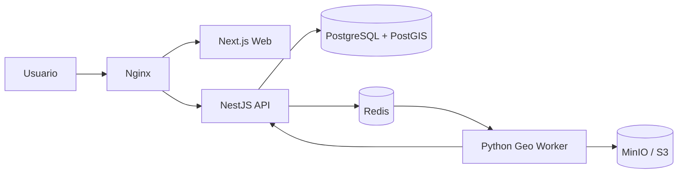

# Contexto del sistema

La plataforma expone una aplicacion web y una API publica detras de Nginx. La API usa PostgreSQL/PostGIS para datos y geometria, Redis para cola de trabajos, MinIO/S3 para objetos grandes y un worker Python privado para procesamiento geoespacial.

